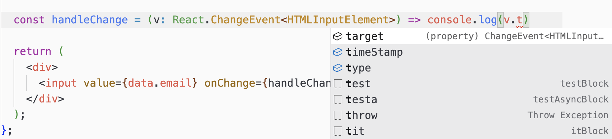
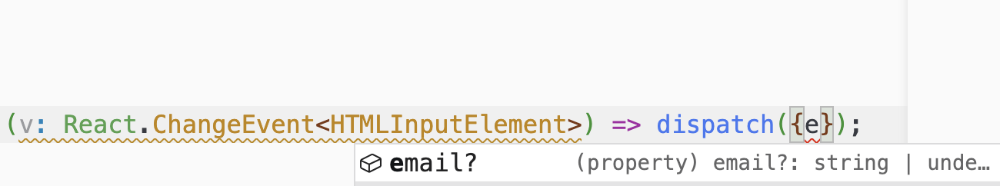
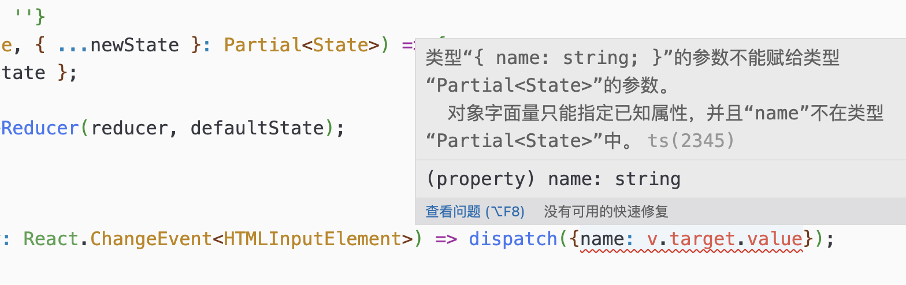
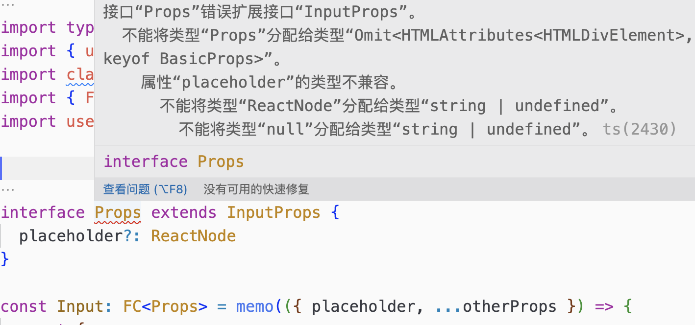
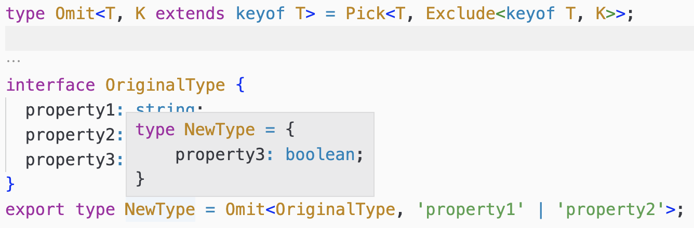
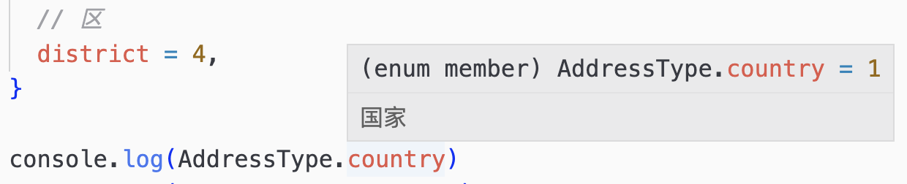
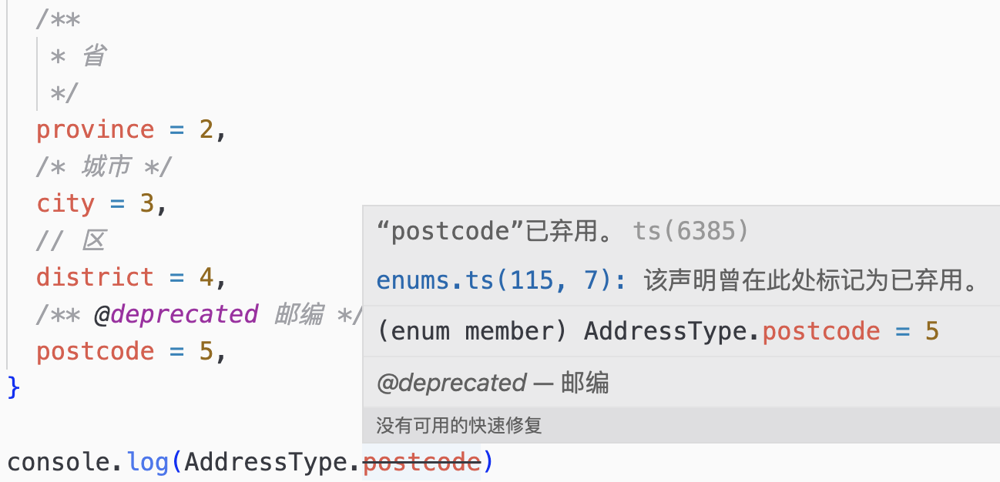

# TS常见类型操作

本文主要介绍实际开发中比较常用的 TS 语法，比如操作符和类型操作工具

## 1.常见操作符

### typeof 用于获取对象或者函数的结构类型

```ts
const a2 = {
  name: 'xm',
};

type T1 = typeof a2; // { name: string }

function fn1(x: number): number {
  return x * 10;
}

type T2 = typeof fn1; // (x: number) => number

const fn: T2 = (x) => x.toString() // Type 'string' is not assignable to type 'number'.
```

### keyof 用于获取某种类型的所有键，其返回值是联合类型

```ts
interface Person {
  name: string;
  age: number;
}

export type KeyPerson = keyof Person;

const p: KeyPerson = 'name'; // 'name' | 'age'
```

### in 用于遍历联合类型。

```ts
const obj = {
  name: 'cc',
  age: 20,
};

type T3 = {
  [P in keyof typeof obj]: string;
};

/*
{ name: string, age: string }
*/

// 在类型映射中，P 是一个通用的类型参数，你可以将其替换为任何你喜欢的名称。它表示正在遍历的属性的名称。
```

### T[K] 用于访问索引，得到索引对应的值的联合类型

```ts
interface I3 {
  name: string;
  age: number;
}

type T6 = I3[keyof I3]; // string | number
```

### 一个例子

```ts
export enum StateEnum {
  major = 1,
  minor = 2,
  patch = 3,
}
```

1. 获取 StateEnum 类型
2. 获取 StateEnum 的属性的联合类型
3. 获取 StateEnum 的值的联合类型

注：附1.1

## 2.泛型使用

### React 组件定义

对组件的 Props 进行定义，一般可以直接用 Props 或者使用 React.FC

```tsx
interface Props {
  name: string;
}

const AComponent = (props: Props) => {
  return <div></div>;
};
```

```tsx
interface Props {
  name: string;
}

const AComponent: FC<Props> = (props) => {
  return <div></div>;
};
```

```ts
type FC<P = {}> = FunctionComponent<P>;

interface FunctionComponent<P = {}> {
  (props: P, context?: any): ReactElement<any, any> | null;
  // ...
}
```

### React 事件

使用原生 input

```tsx
const handleChange = (v: React.ChangeEvent<HTMLInputElement>) => {
  console.log(e);
};
```

```ts
// T = Element 指定默认类型  SyntheticEvent 表示一个合成事件
// EventTarget 是  DOM 事件的基础接口， T 是泛型类型参数，在 ChangeEvent<T> 中代表特定的类型。当你使用 ChangeEvent 时，可以根据需要指定 T 的具体类型
interface ChangeEvent<T = Element> extends SyntheticEvent<T> {
  target: EventTarget & T;
}
```

& 表示交叉类型，即 EventTarget 和 T 的交叉类型，具有 EventTarget 和 T 的所有属性

如果使用 | 联合类型，那么就只能使用 EventTarget 和 T 的共有属性



### 组件应用

比如设计一个 Select，Select 的 options 里面的值是不确定的，可以是字符串，也可以是对象，这个时候就可以使用泛型

```tsx
interface Value {
  name: string;
  desc: string;
  id: number;
  disabled?: boolean;
}

interface IProps<T> {
  list: T[];
  onClose: () => void;
  value?: T;
  onConfirm: (v: T) => void;
}

const Select = (props: IProps<Value>) => {
  const { list, value, onConfirm } = props;
  return (
    <div>
      {list.map((item: Value) => (
        <div key={item.id} onClick={() => onConfirm(item)}>
          {item.name}
        </div>
      ))}
    </div>
  );
};
```

## 3.使用 Partial 将属性变得可选

Partial 的作用是将所有属性变为可选

```tsx
interface State {
  email: string;
  password: string;
}

const Cop = () => {
  const reducer = (state: State, { ...newState }: Partial<State>) => {
    return { ...state, ...newState };
  };
  const [data, dispatch] = useReducer(reducer, defaultState);

  // dispatch 会进行属性提示,
  // 非 state 里面的值会抛错
  const handleEmailChange = (v) => dispatch({});
};
```





问题：Partial 如何实现

附：1.2

## 4.Pick 与 Omit

Pick 与 Omit 都是从一个对象中选取部分属性，Pick 选取的是需要的属性，Omit 选取的是不需要的属性

在第三方组件基础上进行修改，比如 placeholder 想要在上面拓展，让他能够支持 ReactNode 类型，如果直接声明会报错。



应该用如下写法

```tsx
interface Props extends Omit<InputProps, 'placeholder'> {
  placeholder?: ReactNode;
}
```

Omit 实现

```ts
type Omit<T, K extends keyof T> = Pick<T, Exclude<keyof T, K>>;

interface OriginalType {
  property1: string;
  property2: number;
  property3: boolean;
}
type NewType = Omit<OriginalType, 'property1' | 'property2'>;
```



```ts
type A = 'a' | 'b' | 'c';
type B = 'a' | 'b';
type C = Exclude<A, B>; // C 的类型为 'c'

type Exclude<T, U> = T extends U ? never : T;
```

```ts
K in keyof T // K 可以是 T 类型的任意属性名，用于遍历 T 的所有属性
K extends keyof T // K 必须是 T 类型的属性之一，约束泛型类型参数的范围
```

Pick

```ts
type T4 = Pick<
  {
    name: string;
    age: number;
  },
  'name'
>;

/*
这是一个新类型，T4={name: string}
*/
```

Pick 手动实现

附：1.3

## 5.其他 Tips

### 注释

```ts
export const enum AddressType {
  /** 国家 */
  country = 1,
  /**
   * 省
   */
  province = 2,
  /* 城市 */
  city = 3,
  // 区
  district = 4,
}
```



定义基础组件的 Props 时，可以使用 `/** */` 注释，这样在使用的时候就会有提示

对于即将废弃的方法或者属性，可以通过 `@deprecated` 符号进行注释，这样在使用的时候会有中划线删除提示



### 类型断言 as

类型断言（Type Assertion）用于告诉编译器某个值的具体类型，即在特定情况下你比编译器更了解值的类型，并希望将其视为你所指定的类型。在 React 中，类型断言使用 as 语法

多用于解决编译器报错问题

比如 类型定义为

```tsx
type Value = string | undefined;

const getLength = (v: Value): number => v.length;
// 这里的 Value 可能是第三库的定义类型，但是我们这里使用的时候确定 v 是一个字符串参数
// 这里面会抛错: v可能是 undefined
// 可以通过类型断言解决

const getStringLength = (v: Value): number => (v as string).length;
```

## 6.附

### 1.1

获取枚举属性及属性值的联合类型

```ts
type StateType = typeof StateEnum; // { major: string; minor: string; patch:string }

// 获取 Enum 属性的联合类型 "major" | "minor" | "patch"
type StateValue = keyof typeof StateEnum;

const test1: StateProperty = 'major';
const test2: StateProperty = 'major1'; // 类型“"major1"”不可分配给类型“"major" | "minor" | "patch"”

// 获取 Enum 值的联合类型

type StateValue = StateType[keyof StateType];

const test3: StateValue = 1;
const test4: StateValue = 1000; // 不能将类型“1000”分配给类型“StateValue”

// 泛型实现
type ValuesOfEnum<T> = T[keyof T];

type MyStateType = ValuesOfEnum<typeof StateEnum>;
```

### 1.2

Partial 实现

```ts
type MyPartial<T> = {
  [P in keyof T]?: T[P];
};
```

### 1.3

Pick 实现

```ts
type Pick<T, K extends keyof T> = {
  [P in K]: T[P];
};
```