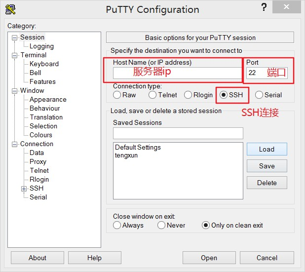
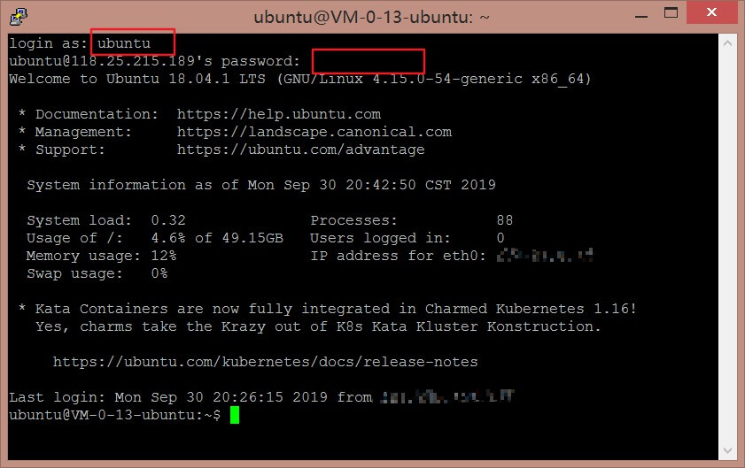

# ubuntu服务器终端及图形界面连接
使用的unbuntu版本 18.04.01 LTS 64位

这里说一下远程连接Linux的几种方式
- 使用XDCMP协议通过图形化桌面远程连接到Linux(使用xManger的xbrowser)
- 使用SSH协议连接到Linux服务器(PuTTY或者xManger)
- 通过xstart sample 图形化界面连接到Linux(使用xManger)

如果只是单纯的连接到linux终端命令行，使用PuTTY已SSH协议连接即可，简单易操作

安装PuTTY(笔者使用的是0.70版本)，打开后只需要填写ip地址，点击open即可

打开命令行界面后，输入用户名，密码(密码先复制好并在光标处右击即可)，连接成功

然后就可以愉快的使用命令行啦~

但是初学者对于命令行比较恐惧，希望可以先从图形界面熟悉起来(没错，是本人了。。)

连接到图形界面需要使用XDCMP协议，
需要先安装一下xManger(笔者使用的是6.0中文版)