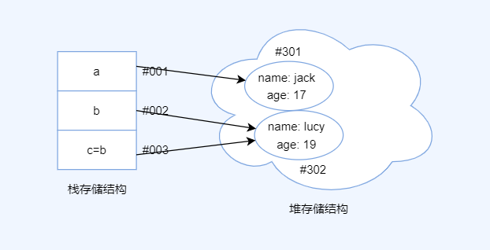
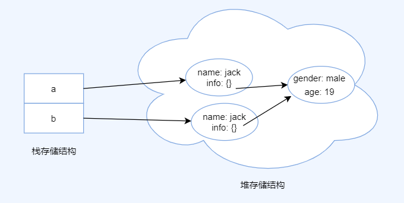

# 赋值与深浅拷贝

在 JS 中，我们会频繁的使用对象这种引用类型的数据，操作不当可能会发生意料之外的情况。

在 JS 中，数据类型分为值类型和引用类型。其中值类型包括：`'string', 'number', 'bool', 'undefined', 'null', 'symbol', 'bigint'`这 7 个。要注意的是，这几个单词需要加上引号才是关键字，所以使用`typeof`返回的是字符串关键字，比如`typeof 2` 返回的是`'number'`

引用类型包括`Object`类型，`Object`和字符串`'object'`都是关键字，`Object`类型引申出来的常用的还有 `Array`, `Function`等。比如，当我们使用`function foo() {}; foo instanceof Object`返回为`true`。`instanceof`实现的原理是构造函数的原型链，即对`prototype`的查找

通常，当我们对值类型进行赋值时，内存会给该值分配一个地址空间，以下图为例


```js
let a = 1 // 计算机内栈结构开辟出一个新的地址#001，该地址存储的值为1

let b = 2 // 计算机内栈结构开辟出一个新的地址#002，该地址存储的值为2

let c = b // 计算机内栈结构开辟出一个新的地址#003，该地址存储的值与地址#002存的值一样，都是2

c = 3 // 对地址#003存储的值进行更改，改为3，这并不会影响#002地址所存储的值，即c与b值得变化互相不会影响
```

那么，引用类型赋值时怎么回事呢？以下图为例



```js
let a = { name: 'jack', age: 17 } // 计算机内堆结构开辟出一个新地址#301，用于存放 {name: 'jack', age: 17}。紧接着，栈结构开辟出一个新地址#001，该地址存放a变量，同时，#001指向#301这个堆地址

let b = { name: 'lucy', age: 19 } // 计算机内堆结构开辟出一个新地址#302，用于存放 {name: 'lucy', age: 19}。紧接着，栈结构开辟出一个新地址#002，该地址存放b变量，同时，#002指向#302这个堆地址

let c = b // 栈结构开辟出一个新地址#003，该地址存放c变量，同时，#003指向#302这个堆地址，也就是说#002与#003指向的是同一个堆地址

c.name = 'lily' // 编译器找到c #003指向的#302这个堆地址存放的数据，并更改它

// 显而易见，由于c和b指向的是同一个堆地址，所以b也会受到影响，但这大多数时候并不是我们想要的结果
console.log(b.name) // 'lily'
```

可以看出，当我们把一个声明 b 的对象值赋值给另外一个声明 c 时，这两个声明用的其实是同一个对象引用，那么，如何避免这种情况呢？

显然，需要把 b 的堆对象在重新复制一遍产生新的堆对象地址，并且使 c 指向这个新的堆对象地址。

> 最常见的情况，比如，事件绑定的回调函数，我们使用addEventListener和removeEventListener传递的必须是同一个引用才能移除事件。
> 在使用 React 的过程中，由于组件的重新渲染，组件内部的事件回调函数在经过另一次渲染过后和之前的函数已经不是同一个引用了，即引用地址发生了变化，Component 解决方法是将该函数声明在 constructor 中，Hooks 解决办法是使用 useMemo/useCallback 保证函数的引用地址不发生变化

## 实现浅拷贝

```js
let b = { name: 'lucy', age: 19 }
let c = { ...b }
```

上述代码实现了一个简单的浅拷贝，`...`是展开运算符，应用的是 `for-of` 语法，`for-of`调用的是内置的`Symbol['iterator']`本质上还是对 `b` 对象进行遍历。

实现一个浅拷贝函数

```js
function mixin(receiver, supplier) {
  Object.keys(supplier).forEach(function(key) {
    receiver[key] = supplier[key]
  })
  return receiver
}
```

> 浅拷贝的使用场景，比如 react-redux，当我们在对 redux state 进行更改时，不应该直接改变 state 状态，而是返回一个新的状态，通常我们会用展开运算符...或者 Object.assign 对原数据进行浅拷贝

浅拷贝的缺点也很明显，如下图



当浅拷贝的对象的 `key` 对应的 `value` 也是个引用类型的值时，无法进行正确的拷贝，拷贝的还是 `value` 对应的地址。

```js
let a = {
  name: 'jack',
  info: {
    gender: 'male',
    age: 19,
  },
}
let b = { ...a }
b.info.gender = 'female'
console.log(a.info.gender) // 输入 female，说明a info属性值也被修改了
```

这个时候可能就需要用到深拷贝了，深拷贝之前，我们再说一下其他的几种浅拷贝，比如

```js
Object.assign()
let obj = {
  username: 'kobe',
}
let obj2 = Object.assign({}, obj)

// 数组中还有：
Array.prototype.slice()
Array.prototype.concat()
let arr = [1, 3, 4]
let arr2 = arr.concat()
let arr3 = arr.slice()
```

## 实现深拷贝

```js
const newObj = JSON.parse(JSON.stringify(oldObj))
```

原理： 用 JSON.stringify 将对象转成 JSON 字符串，再用 JSON.parse()把字符串解析成对象，一去一来，新的对象产生了，而且对象会开辟新的栈，实现深拷贝。

缺陷，对于引用类型以及循环引用的克隆存在问题：

- 拷贝时间类型，会被转化为字符串类型，导致时间类型上的方法会丢失
- 当对象中有 undefined 和 Function 类型时，会直接丢失
- 存在循环引用会直接报错

这里实现一个简易的深拷贝，递归方法实现深度克隆原理：遍历对象、数组直到里边都是基本数据类型，然后再去复制，就是深度拷贝

```js
// 检测数据类型
function checkType(target) {
  // "[object String]" 截取为 String
  return Object.prototype.toString.call(target).slice(8, -1)
  // -1 会被看做 strLength - 1
}

function clone(target) {
  let result,
    targetType = checkType(target)
  if (targetType === 'Object') {
    result = {}
  } else if (targetType === 'Array') {
    result = []
  } else {
    return target
  }
  // 对数组以及对象数据 遍历
  for (let i in target) {
    // 遍历数据结构中的每一个key
    let value = target[i]
    if (checkType(value) === 'Object' || checkType(value) === 'Array') {
      // 对象的属性值仍然是数组或者对象，进入递归
      result[i] = clone(value)
    } else {
      result[i] = value
    }
  }
  return result
}

// 测试
const cc = {
  name: 'xbl',
  info: {
    age: 17,
    desc: {
      gender: 'male'
    }
  }
}

const dd = clone(cc)
dd.info.desc.gender = 'female'

// 测试原始数据CC是否发生了改变
console.log(cc.info.desc.gender) // 打印'male'说明深拷贝成功
```

## 参考

- [深入浅出 es6]()
- [浅拷贝与深拷贝](https://juejin.im/post/5b5dcf8351882519790c9a2e)
- 后面的几篇大同小异，可以帮助理解一下
- [不要再问我 JS Clone 的问题了](https://juejin.im/post/5d5a8be3f265da03b638ad28)
- [搞不懂 JS 中赋值·浅拷贝·深拷贝的请看这里](https://juejin.im/post/5d235d1ef265da1b855c7b5d)
- [聊聊对象深拷贝和浅拷贝](https://juejin.im/post/5c26dd8fe51d4570c053e08b)
- [深克隆](https://www.cxymsg.com/guide/jsWritten.html#深克隆（deepclone）)
