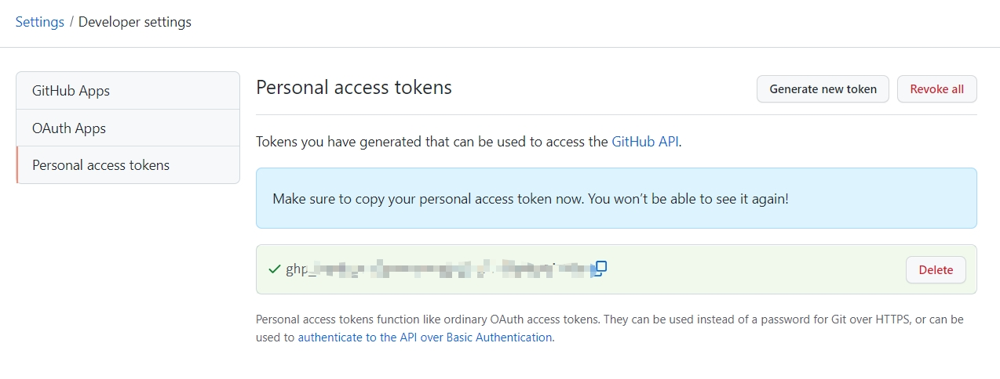
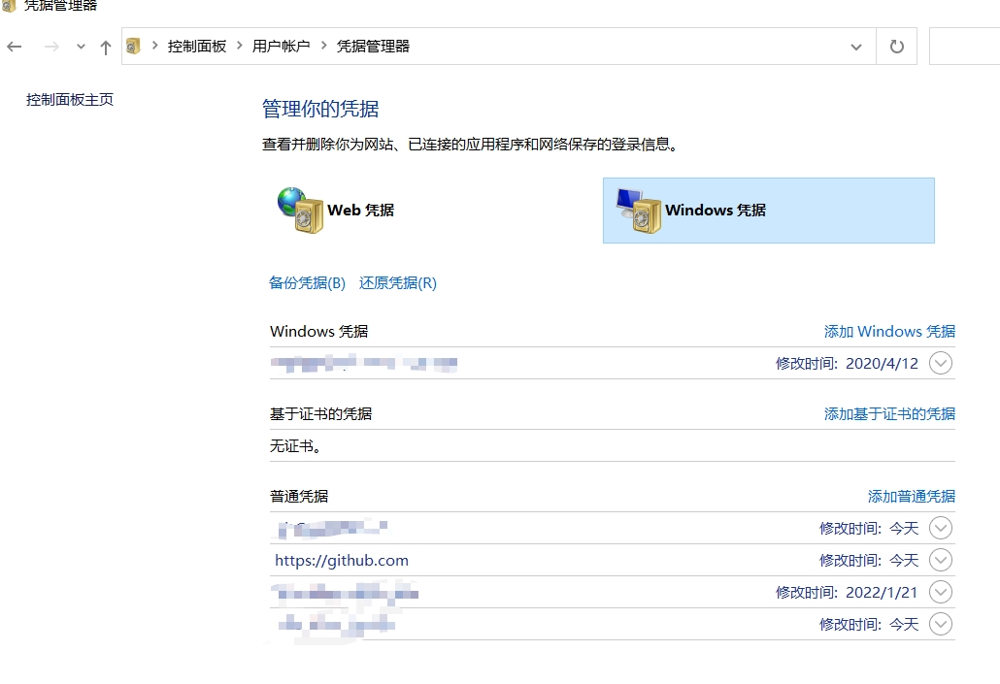
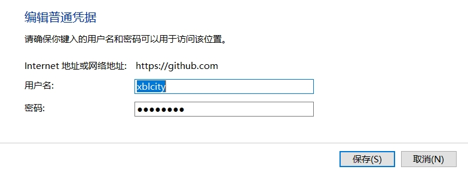
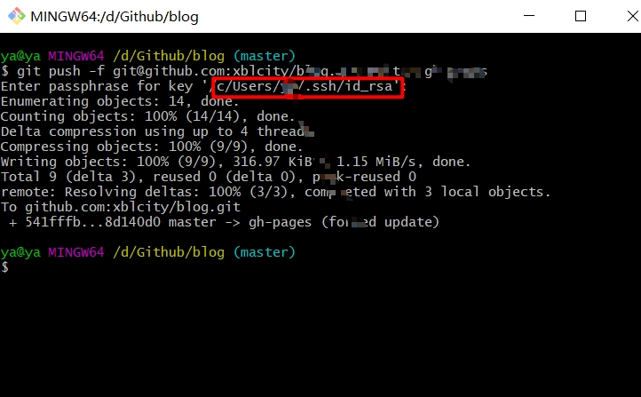
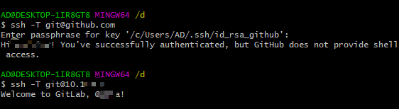

# Git 多账号配置

## Git新的账号配置规则

`git push`出现以下错误 `remote: Support for password authentication was removed on August 13, 2021. Please use a personal access token instead.
remote: Please see https://github.blog/2020-12-15-token-authentication-requirements-for-git-operations/ for more information.
fatal: Authentication failed for 'https://github.com/xblcity/blog.git/'`

这是因为从 `2021 年 8 月 13 日` 开始，在 GitHub.com 上对 Git 操作进行身份验证时，不再接受帐户密码。

—— [Git 操作的令牌认证要求](https://github.blog/2020-12-15-token-authentication-requirements-for-git-operations/)

需要新创建令牌用于替代之前的密码 [创建个人访问令牌](https://docs.github.com/en/authentication/keeping-your-account-and-data-secure/creating-a-personal-access-token)

最后创建的token如下：



windows用户可以接着执行以下操作：

找到windows凭据，查看是否有github账户，如果有，则需要将刚才创建的token把密码替换掉。如果没有，则新建。





配置完之后，通过`https`连接的仓库可以成功 `push`

通过`SSH`连接在`push`时也出现错误，通过重新配置`SSH`秘钥解决问题 [生成新 SSH 密钥并添加到 ssh-agent](https://docs. github.com/cn/github/authenticating-to-github/generating-a-new-ssh-key-and-adding-it-to-the-ssh-agent) 在输入密码的时候输入的是之前保存的`Token`



## Github多账号配置

Git 全局只能保存一个用户和用户名，而如果同时使用`gitlab`和`github`，账号可能会混淆。需要手动更改配置让本地拥有多个账号。

以`SSH`连接为例，首先要在本地生成`SSH`密钥。

### 生成密钥

生成密钥可以参考官方文档[生成新 SSH 密钥并添加到 ssh-agent](https://docs.github.com/cn/github/authenticating-to-github/generating-a-new-ssh-key-and-adding-it-to-the-ssh-agent)，以`window`为例：

#### 1.配置 gitlab

1. 打开 Git Bash
2. 输入以下命令

```shell
ssh-keygen -t ed25519 -C "your_email@example.com"
```

3. 提示您“Enter a file in which to save the key（输入要保存密钥的文件）”时，按 Enter 键。 这将接受默认文件位置。这里输入`id_rsa_gitlab` 会生成 `id_rsa_github` 以及 `id_rsa_github.pub` 两个文件

4. 在提示时输入安全密码。

5. 最后登录 gitlab 网页，在 `setting > ssh keys` 增加一个 ssh key 即可，把 `.ssh` 文件下的 `id_rsa.pub` 文件内容全部复制到 Key 内容。

#### 2.配置 github

github 同理，但需要注意，在上述第三步时，需要输入要自定义保存位置防止覆盖，比如输入 `id_rsa_github`

### 配置 Config

在 `.ssh`文件下新建 config 文件(没有后缀名)。文件内容如下

```shell
# gitlab
Host your_host@example.com #服务器别名
HostName your_host@example.com #主机地址
User your_email@example.com #邮箱地址
IdentityFile C:/Users/AD/.ssh/id_rsa_gitlab #对应gitlub 密钥路径
IdentitiesOnly yes #只接受SSH key 登录
PreferredAuthentications publickey #强制验证方式，这里使用的是publickey

# github
Host github.com #服务器别名
HostName github.com #主机地址
User your_email@example.com #邮箱地址
IdentityFile C:/Users/AD/.ssh/id_rsa_github #对应github 密钥路径
IdentitiesOnly yes #只接受SSH key 登录
PreferredAuthentications publickey #强制验证方式，这里使用的是publickey
```

**_注意密钥的文件地址！_**

### 测试连接

```shell
ssh -T git@gitlab
# 别名或者
ssh -T git@your_host@example.com
# 出现 successfully authenticated 或者 welcome 字样则配置成功
```

```shell
ssh -T git@github.com
# 或者
ssh -T git@your_host@example.com
```



如果出现 ` Permission denied (publickey)` 字样则说明未配置成功

使用 `ssh -T git@github.com -v` 命令查看具体报错

### 配置 user

如果之前配置过全局的 user 和 username，需要先清空

```js
git config --global --unset user.name
git config --global --unset user.email
```

然后在项目根目录下配置当前的 user 和 username，不配置 push 会报 `user.name` 不存在的错误

```js
git config --local user.name "your name"
git config --local user.email "your email"
```

### 问题

1. 在 push 出现错误 `fatal: unable to access 'https://github.com/xx/xx.git/': OpenSSL SSL_read: Connection was reset, errno 10054`

一般是这是因为服务器的 SSL 证书没有经过第三方机构的签署，解决方法 `git config --global http.sslVerify "false"`

2. 主机地址与服务器别名原先分别设置为 Host github.comHostName github.com 的时候，clone 项目的时候无权限，猜测可能是和Host有关

解决方案：HostName 和 Host 统一改成 github.com

3. 每次push 都提示Enter passphrase for key 'xxx'

解决方案：在生成key的时候不输入密码(如果已经生成key，再重新生成一次覆盖原文件)
## 参考

- [window 下 git 多账户管理](https://juejin.cn/post/6912337687366565895)
