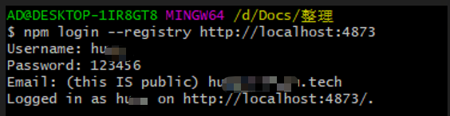

# windows 系统搭建私有 npm 仓库

## 1.verdaccio(目前在使用的)

### 1.1 Docker windows 安装及配置(v19.03.12) 如果已安装，请忽略此步骤

- [下载 Docker Desktop](https://www.docker.com/get-started)，找到 `Docker Desktop -> Download for Windows` 下载并安装
- `powershell` 命令行 测试是否安装成功 `docker -v`
- 从 Docker Hub 获取 hello-world 镜像(image) 并且运行一个容器(Container)，用来测试 docker 是否运行正常。 `docker run hello-world`
- 设置国内镜像源，在面板 `setting -> docker engine -> registry-mirrors` 数组添加 `http://hub-mirror.c.163.com`

### 1.2 verdaccio 安装

使用 Docker 安装，命令行命令如下

```js
// 拉取镜像
docker pull verdaccio/verdaccio

// 运行
docker run -it --rm --name verdaccio -p 4873:4873 verdaccio/verdaccio
```

> PS: 也可以使用 npm 进行全局安装(yarn 安装存在问题，安装之后无法使用 cli)

### 1.3 需要注意两个环境

- 本机 host 使用 npm `registry` 为 `http://localhost:4873/`
- 公司局域网使用 npm `registry` 为 `http://npm.test.tech`

这两个环境除了 `registry` 地址不同，对应的用户不同，发包删除包的操作都是一样的，这里先使用本地 host 进行演示，下面的操作都是用 gitbash 进行操作(使用 powershell 进行登录会报错)

### 1.4 本地 host 操作

#### 初始化用户

```js
npm login --registry http://localhost:4873

// 初始化也可以使用 npm adduser --registry http://localhost:4873

// 接着设置用户名和密码及邮箱
// ...

// 验证当前用户
npm --registry http://localhost:4873 whoami
```



#### 发包

新建一个文件夹用于发布包，并在当前文件夹下使用命令 `npm init --y` 生成 `package.json`

```js
npm --registry=http://localhost:4873 publish
```

打开浏览器 `http://localhost:4873` 可以看到刚才发布的包


#### 删包

删除包，需要在包的根目录执行

```js
npm --registry=http://localhost:4873 unpublish --force
```

#### 退出登录

```js
npm --registry=http://localhost:4873 logout
```

### 1.5 局域网操作

局域网只需要 在输入命令行的时候更改 `registry` 地址 就可以了，发包的时候注意包名以`@ty/`开头，在`package.json`中进行配置

```js
npm --registry http://npm.test.tech login
```

后面的发布删除包与本地 host 环境操作一样

## 2.使用 npmjs.org(私有 npm 仓库搭建的另一种方案，没有采用这种方案)

[官方文档](https://github.com/cnpm/cnpmjs.org)

1. clone npmjs

`git clone git@github.com/cnpm/cnpmjs.org.git`

2. 修改配置文件，比如`scope`等等

_docs/dockerize/config.js_

```js
var config = {
  // ...
  bindingHost: "127.0.0.1",
  // 配置用户名及邮箱
  admins: {
    // name: email
    // admin: 'admin@cnpmjs.org',
  },
  scopes: ["@te", "@te-experiment"],
};
```

_docker-compose.yml 添加 mysql port_

```yml
mysql-db:
  image: mysql:5.6
  restart: always
  environment:
    MYSQL_USER: root
    MYSQL_ALLOW_EMPTY_PASSWORD: "yes"
    MYSQL_DATABASE: cnpmjs_test
    MYSQL_ROOT_HOST: "%"
  ports:
    - "3306:3306"
```

3. 在项目根目录运行 命令 `docker-compose up -d` 将容器注册为服务 [该命令文档](https://docs.docker.com/compose/reference/up/)
4. 浏览器打开 `127.0.0.1:7001` 和 `127.0.0.1:7002` 查看当前仓库
5. 可以安装 `workbench`，查看数据库数据

### 登录与发包

和 `verdaccio` 操作基本一致，都是基于 `npm` 的命令

登录需要在 git 命令行进行操作(在 Powershell 会报错)

```js
// 本地host
npm --registry=http://127.0.0.1:7001 login
// 局域网
npm --registry=http://npm.test.tech login
```

新建一个文件夹用于发布，生成`package.json`

```js
npm --registry=http://127.0.0.1:7001 publish
npm --registry=http://npm.test.tech publish
```

## git bash 配置别名

找到 Git 安装目录 `D:\Program Files\Git\etc` 找到 `profile` 文件，在该文件最后面添加一行

```js
alias tnpm="npm --registry=http://npm.test.tech"
```

再次打开 Git Bash，测试 tnpm 命令 `tnpm -v`，发现可以使用

## powershell 设置别名

```js
Test-Path $profile  // 检测是否存在powershell profile 配置文件
New-Item -path $profile -itemtype file -Force  // 上个命令输出为false就执行本命令，生成一个profile文件

// 修改刚才产生的新文件,改文件可以直接在此电脑-文档-WindowsPowerShell中查看
// 在空文件中添加以下代码
function Start-npmWithAlias {
    $argList = $args -Join ' '
    Start-Process -FilePath 'npm' -ArgumentList "--registry=http://npm.test.tech $argList"  -NoNewWindow
}
Set-Alias tnpm Start-npmWithAlias
```

保存改文件并重启 powershell，会报错，需要输入以下命令

```js
Set-Executionpolicy Remotesigned // 设置powershell以Remotesigned模式运行

// 最后再次执行 tnpm -v 发现可以使用
```

*docker可视化界面*


## 参考

- [verdaccio 官方文档](https://verdaccio.org/docs/zh-CN/docker)
- [Docker 从入门到实践](https://yeasy.gitbook.io/docker_practice/)
- [powershell 创建永久别名](https://blog.csdn.net/weixin_34850743/article/details/100124969)
- [为 Windows PowerShell 设置 User Alias （命令别名）](https://zhuanlan.zhihu.com/p/74881435)
- [powershell 设置临时别名](https://segmentfault.com/q/1010000005644861?_ea=908503)
- [Windows 下 Git Bash 设置别名](https://www.jianshu.com/p/10d013b6e239)
