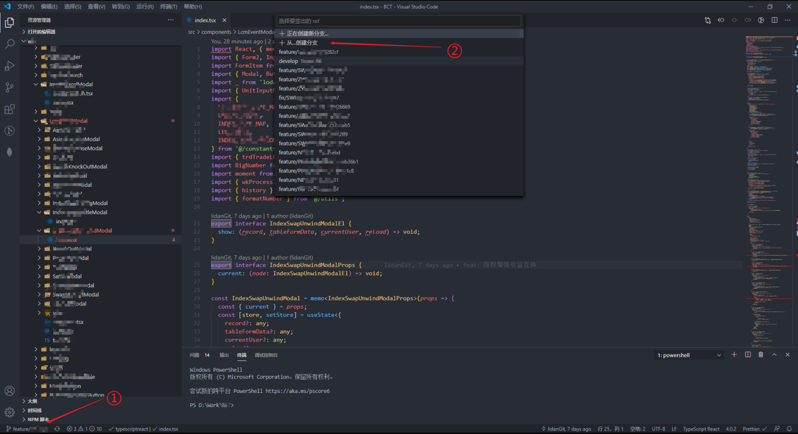
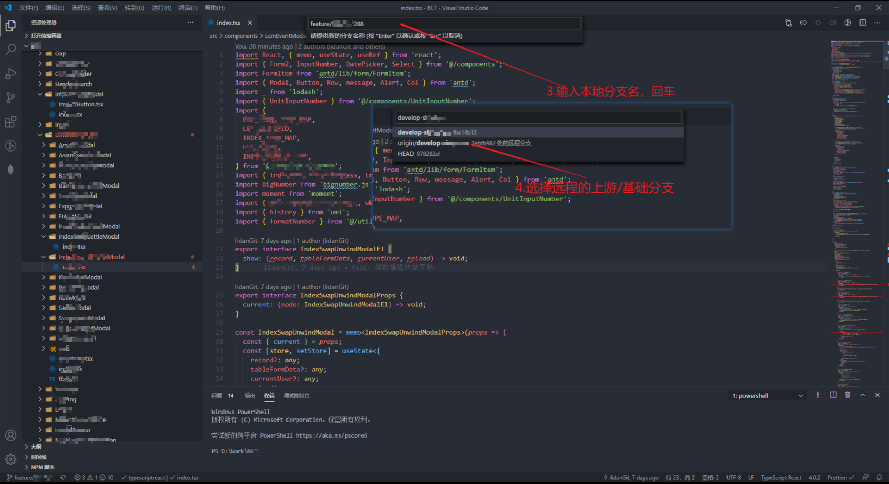
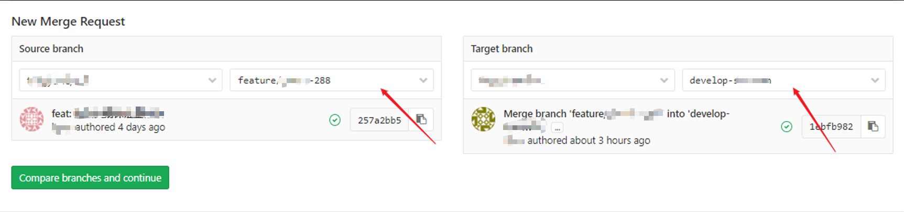
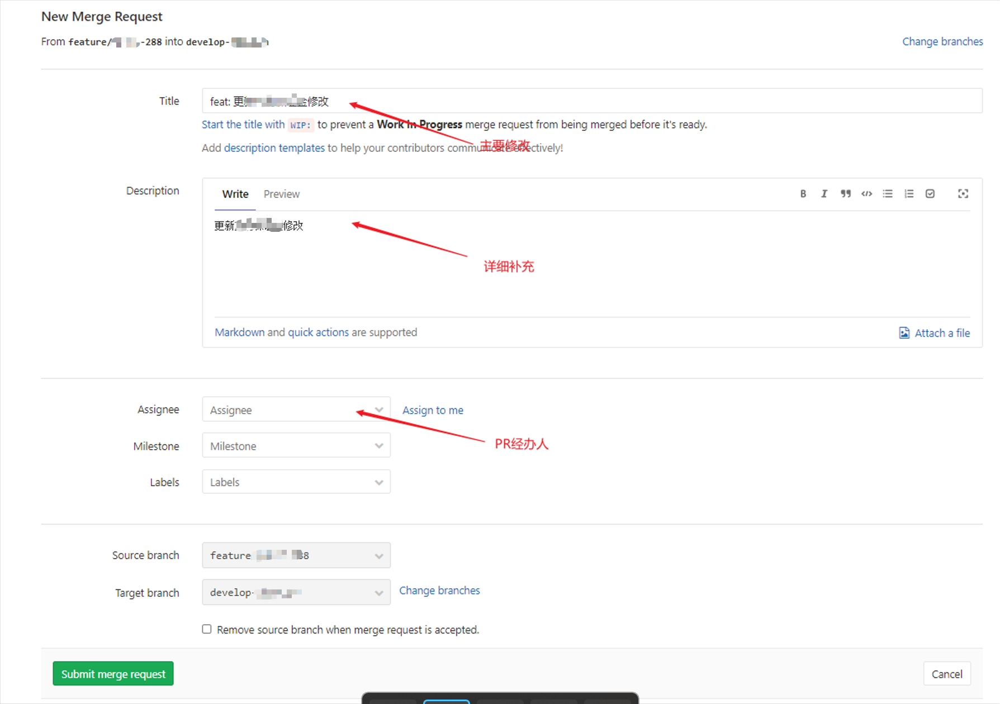
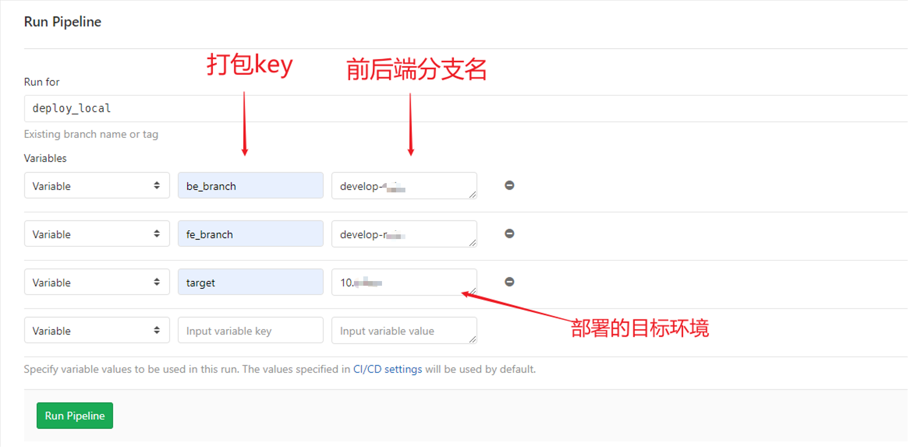

# 前端从切分支到打包上线的流程整理

## 开发与分支命名规范

一般项目开发有三个阶段：开发阶段，测试阶段，稳定版本阶段。下表是相应的说明(假设项目名为test)：

| 远程分支(上游分支) | 本地任务分支                            | 分支说明                 | 阶段                                       |
| ------------------ | --------------------------------------- | ------------------------ | ------------------------------------------ |
| develop-test    | feature/TEST-100(后面的是 jira 任务号) | feature 可理解为新的特性 | 此时为开发阶段                             |
| release/TEST-1.19   | fix/XXXX-10000                          | 可以理解为测试版本       | 此时是测试阶段，此时开发任务主要为 fix bug |
| master             | hotfix/xxx                              | 稳定版本                 | 此时修复的是稳定版本 bug（一般用不到）     |

## 本地开发

确认 jira 任务后，着手开发

本地创建一个新的分支，并指定上游分支

```js
git checkout -b 本地分支名 origin/远程分支名
```

使用 vs code 图形界面进行操作





## 提交代码

当代码 commit 之后

我们需要将本地代码推送到远程

```js
// 推送至远程并在远程创建一个同名分支
git push -u origin feature/TEST-100
```

每次 push 到远程分支，都会触发 pipeline，pipeline 主要走的是安装依赖及构建等过程。 pipeline 能够走成功，说明可以构建成功（会构建到 ci 指定的机器上）。

## 发起 Merge Request

提出 merge request，并填写必要信息





经办人 approve 后且 pipeline 走成功 merge request 将会自动合并

## 部署

指定前后端分支的包并部署到指定环境


