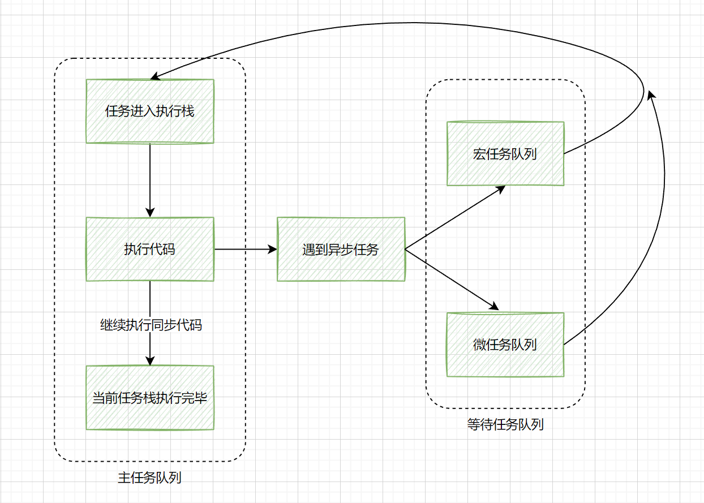

# JS 事件队列/循环(Event Loop)

由于JS是单线程，为了能够更高效的执行，所以对任务的执行做了优化处理，也就是人们常说的事件队列/循环(Event Loop)

下图是一个简略的JS任务执行机制：



浏览器会把主任务队列中的同步任务挨个全部执行完，然后再去等待任务队列中（异步任务）看哪个任务可以执行了，然后把该执行的任务放到主任务队列中去执行，等这个任务执行完，再去等待任务中看谁可以执行了，再把这个任务放到主任务队列中执行... 如此循环。这种循环叫做事件循环（Event Loop）

宏任务(macrotask)和微任务(microtask)是等待任务队列中的异步任务的处理机制。在 ES6 规范中分别为 tasks 和 jobs，一个宏任务里面可能包含多个微任务。

**宏任务(script)开始执行** ——> **遇到微任务就将其 push 到微任务队列中** ——> **...同步代码执行完毕** ——> **微任务队列内的任务依次执行...** ——> **执行第二个宏任务...** ——> **遇到第二个宏任务中的微任务就将其 push 到微任务队列中** ——> ...

宏任务包括：`script(整体代码), setTimeout, setTimeInterval, postMessage, setImmediate, I/O, UI rendering`

微任务包括: `Promise.then() Promise.catch() process.nextTick(Node.js环境)`

那异步操作 `ajax` 是啥情况呢, `js` 执行遇到 `ajax` 也会被放进等待任务队列中去，不过不同的是 `ajax` 不算是宏任务也不算是微任务。`ajax` 执行时间(何时执行完毕)完全取决于收到请求的时间(与网速服务器等有关系)

当代码里只包含同步代码，一个宏任务，一个微任务，代码执行顺序比较容易理解，比如：

```js
setTimeout(function() {
  console.log(1)
})
new Promise(function(resolve, reject) {
  console.log(2)
  resolve(3)
}).then(function(val) {
  console.log(val)
})
console.log(4)
// 输出顺序 `2,4,3,1`
```

1. 执行到 setTimeout，将其添加至宏任务队列
2. 执行 new Promise()函数，打印 2，执行 reolve(3)，并将 Promise 状态进行保存, Promise.then()被添加至微任务队列
3. 打印 4
4. 同步代码执行完毕，执行 Promise.then()这个微任务，打印 3
5. 第一个宏任务执行完毕，执行 setTimeout 这个宏任务，打印 1

如果是使用 `async-await` 呢？

`async-await` 可以看做是 `generator` 与 `Promise` 的语法糖

## 一个普通的 `async-await`

```js
async function async1() {
  console.log("async1 start");
  await async2();
  console.log("async1 end");
}

async function async2() {
  console.log("async2");
}

async1();
console.log('start')
'async1 start' 'async2' 'start' 'async1 end'
```

1. `async1` 函数执行，打印`async1 start`
2. `await async2()`，会阻塞 `async1` 之后的代码，转去执行 `async2()` 的同步代码，打印 `async2`
3. 跳出 `async1` 函数，打印 `start`
4. 同步代码执行完毕，执行微任务，打印 `async1 end`

用伪代码来理解 `await` 的行为

```js
async function async1() {
  console.log('async1 start')
  // 原来代码
  // await async2();
  // console.log("async1 end");

  // 转换后代码
  new Promise((resolve) => {
    // async2();
    console.log('async2')
    resolve()
  }).then((res) => console.log('async1 end'))
}

async function async2() {
  console.log('async2')
}
async1()

console.log('start')
```

比如

`await func(); console.log(555)`

`await` 后面紧跟着的可以看做是 `new Promise(() => {...func()...})`。

那么下一行代码 `console.log(555)` 可以看做是 `Promise.then()` 里面的代码，是个微任务

## async 嵌套例子

```js
async function async1() {
  console.log('async1 start') // 1. 第一个宏任务打印的第一个代码
  await async2() // 2. 执行完async2的同步代码，由于await产生第一个宏任务的第一个微任务，接着跳出async1函数，继续执行第一个宏任务的同步代码
  console.log('async1 end') // 4. 执行第一个宏任务的第一个微任务的代码，
  setTimeout(() => {
    // 7. 执行第一个宏任务的第一个微任务代码，产生第四个宏任务
    console.log('timer1')
  }, 0)
}
async function async2() {
  // 2.
  setTimeout(() => {
    // 5. async2函数执行，产生第二个宏任务
    console.log('timer2')
  }, 0)
  console.log('async2') // 2. async2的同步代码被执行完毕
}
async1()
setTimeout(() => {
  // 6. 第一个宏任务同步代码执行到这里产生了第三个宏任务
  console.log('timer3')
}, 0)
console.log('start') // 3. 第一个宏任务的同步代码执行，
```

依次打印`async1 start， async2， start，async1 end` 宏任务依次执行 `timer2 timer3 timer1`

## 在 async 函数中 return 会怎样

```js
async function fn() {
  // return await 1234
  // 等同于
  return 123
  // return 即相当于 Promose.resolve(123)
}
fn().then((res) => console.log(res))

async function fn() {
  await 1234
}
fn().then((res) => console.log(res))
// resolve为空
```

## 在 await 后面写 Promise 会怎么样

```js
async function async1() {
  console.log('async1 start')
  await new Promise((resolve) => {
    console.log('promise1')
  })
  console.log('async1 success')
  return 'async1 end'
  // 上面四行代码等同于
  // new Promise((resolve, reject) => {
  //   new Promise(resolve => {
  //     console.log('promise1')
  //   }).then(res => {
  //     console.log('async1 success')
  //     return 'async1 end'
  //   })
  // })
}
console.log('srcipt start')
async1().then((res) => console.log(res))
console.log('srcipt end')
```

由于在 await 后面没有返回值，所以 await 后面的代码没有执行，可以参考注释的代码

## 复杂情况示例 1

```js
console.log('script start') // 1. 第一个宏任务的第一个同步打印代码
async function async1() {
  await async2() // 2. 执行async2, await产生第一个宏任务的第一个微任务
  console.log('async1 end') // 5.
}
async function async2() {
  console.log('async2 end') // 2. 第一个宏任务的第二个同步打印代码
}
async1()
setTimeout(function() {
  // 8. 第一个宏任务产生的第二个宏任务
  console.log('setTimeout')
}, 0)
new Promise((resolve) => {
  console.log('Promise') // 3. 第一个宏任务的第三个同步打印代码
  resolve()
})
  .then(function() {
    // 6. 第一个宏任务的第二个微任务
    console.log('promise1')
  })
  .then(function() {
    // 7. 第一个宏任务的第三个微任务
    console.log('promise2')
  })
console.log('script end') // 4. 第一个宏任务的第四个同步打印代码
```

第一个宏任务中同步代码: `script start，async2 end，Promise，script end`
第一个宏任务中微任务：`async1 end，promise1，promise2`
第二个宏任务`setTimeout`

## 复杂情况示例 2

```js
async function async1() {
  await async2()
  // 1. 执行async2，async2执行完毕，紧接着产生第一个宏任务的第一个微任务
  console.log('async1 执行完毕') // 5.
  // 上面两行代码等同于
  // new Promise((resolve, reject) => {
  //   await console.log('async2 执行完毕')
  //   // 上面一行代码等同于
  //   new Promise(rsolve => {

  //   })
  // })
}
async function async2() {
  await console.log('async2 执行完毕') // 1. async2又遇到await，因为是第一个await，所以立即执行
  // 之后又产生第一个宏任务的第三个微任务
}
async1()

setTimeout(function() {
  // 在第一个宏任务中产生第二个宏任务
  console.log('定时器执行完毕')
}, 0)

new Promise((resolve, reject) => {
  console.log('Promise开始执行') // 3. 第一个宏任务中的同步代码
  resolve()
})
  .then(function() {
    // 4  .then 产生第一个宏任务中的第二个微任务代码
    console.log('Promise.then执行')
  })
  .then(function() {
    // 6 .then 产生第一个宏任务中的第四个微任务代码
    console.log('Promise.then222执行')
  })

console.log('script同步队列执行完毕') // 3. 第一个宏任务同步代码执行完毕
```

这个例子与上面一个例子的唯一区别就是 aysnc2 的内部又包含了 await

第一个宏任务中同步代码: `async2 执行完毕，Promise开始执行，script同步队列执行完毕`
第一个宏任务中微任务：`Promise.then执行，async1 执行完毕，Promise.then222执行` (Promise.then 比 async1 先执行，这个地方比较难理解)
第二个宏任务`定时器执行完毕`

<!-- ### 再一个例子

对于微任务队列 打印的顺序是 `async1 end promise1 promise2` Chrome73 版本及之后，先执行 async1 再执行 promise1 和 promise2。区别在于`RESOLVE(thenable)`和`Promise.resolve(thenable)。`之间的区别

```js
async function f() {
  await p
  console.log('ok')
}
// 简化理解为
function f() {
  return RESOLVE(p).then(() => {
    console.log('ok')
  })
}
``` -->

<!-- ### 实际中的一个例子

```js
// ajax发送
function myAsyncFunction(url) {
  return new Promise((resolve, reject) => {
    const xhr = new XMLHttpRequest()
    xhr.open('GET', url)
    xhr.onload = () => resolve(xhr.responseText)
    xhr.onerror = () => reject(xhr.statusText)
    xhr.send()
  })
}

// 统一获取数据
fetchData()
async function fetchData() {
  // 获取查询条件
  const res1 = await getFilterData().next().value // 返回的是个promise
  console.log('res1', res1)
  // 根据查询条件进行匹配与设置参数
  const res2 = await getWant() //
  console.log('res2', res2)
  // 根据参数进行数据请求
  const res3 = await getData() //
  console.log('res3', res3)
}

// 获取数据1
function* getFilterData() {
  yield myAsyncFunction('https://douban.uieee.com/v2/movie/top250?start=1&count=1')
}

// 获取数据2
async function getWant() {
  const type = 1
  if (type === 1) {
    await getWantType1().next().value
  } else {
    await getWantType2().next().value
  }
}

// 获取数据3
async function getData() {
  return await getList().next().value // 使用return 拿到返回值
}

function* getWantType1() {
  yield myAsyncFunction('https://douban.uieee.com/v2/movie/top250?start=1&count=2')
}

function* getWantType2() {
  yield myAsyncFunction('https://douban.uieee.com/v2/movie/top250?start=1&count=3')
}

function* getList() {
  yield myAsyncFunction('https://douban.uieee.com/v2/movie/top250?start=1&count=10')
}
// 分别打印res1 Promise res2空 res3 Promise
```

async async 嵌套使用 return 拿到返回的 Promise

## 2. Node 事件循环 -->

## 参考

- [宏任务 && 微任务](https://www.pianshen.com/article/9022536115/)
- [要就来 45 道 Promise 面试题一次爽到底](https://juejin.im/post/5e58c618e51d4526ed66b5cf)
- 较基础[Js 的事件循环(Event Loop)机制以及实例讲解](https://juejin.im/post/5b24b116e51d4558a65fdb70)
- 较详细[Event Loop 详解](https://github.com/xiaomuzhu/front-end-interview/blob/master/docs/guide/eventLoop.md)
