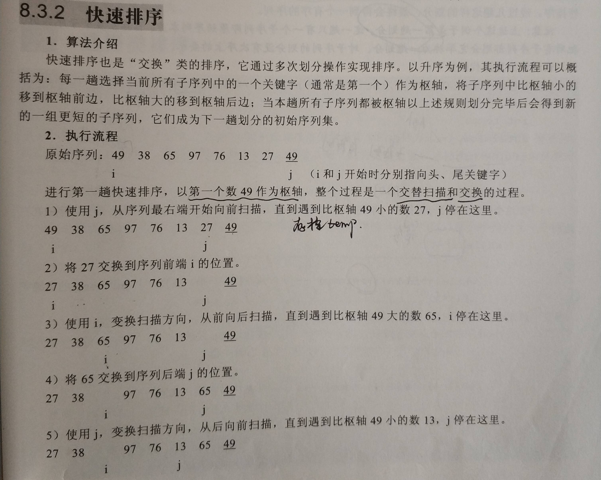
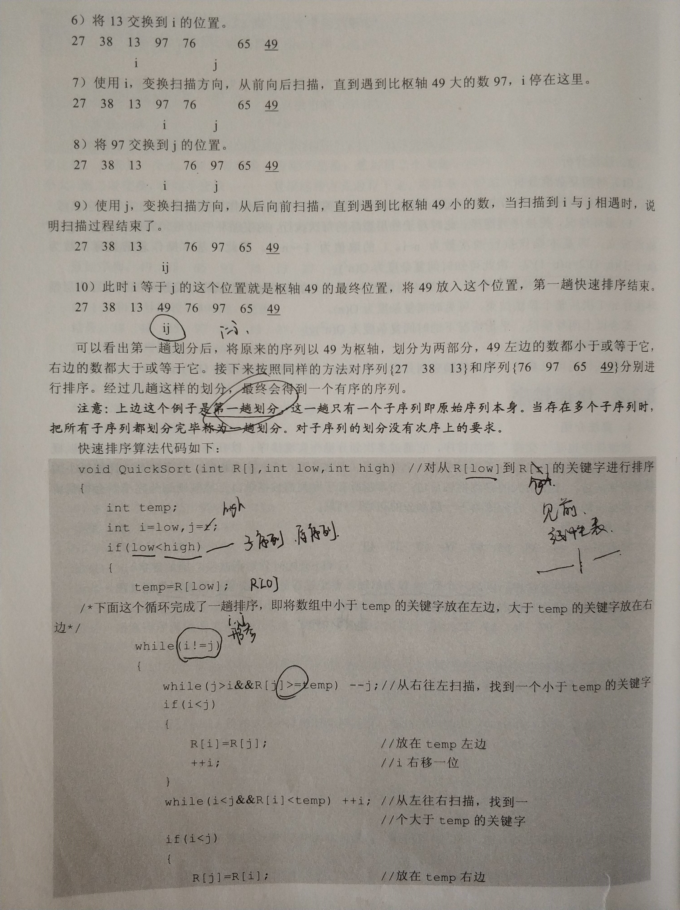
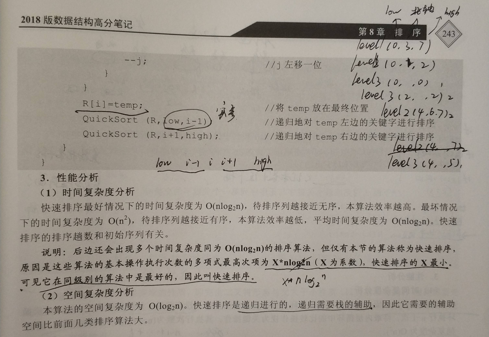

# 数据结构与算法

数据结构与算法知识点比较多，需要反复理解与记忆

## 数据结构

栈：一种遵从先进后出 (LIFO) 原则的有序集合；新添加的或待删除的元素都保存在栈的末尾，称作栈顶，另一端为栈底。在栈里，新元素都靠近栈顶，旧元素都接近栈底。

队列：与上相反，一种遵循先进先出 (FIFO / First In First Out) 原则的一组有序的项；队列在尾部添加新元素，并从头部移除元素。最新添加的元素必须排在队列的末尾。

链表：存储有序的元素集合，但不同于数组，链表中的元素在内存中并不是连续放置的；每个元素由一个存储元素本身的节点和一个指向下一个元素的引用（指针/链接）组成。

集合：由一组无序且唯一（即不能重复）的项组成；这个数据结构使用了与有限集合相同的数学概念，但应用在计算机科学的数据结构中。
字典：以 [键，值] 对为数据形态的数据结构，其中键名用来查询特定元素，类似于 Javascript 中的Object。

散列：根据关键码值（Key value）直接进行访问的数据结构；它通过把关键码值映射到表中一个位置来访问记录，以加快查找的速度；这个映射函数叫做散列函数，存放记录的数组叫做散列表。

树：由 n（n>=1）个有限节点组成一个具有层次关系的集合；把它叫做“树”是因为它看起来像一棵倒挂的树，也就是说它是根朝上，而叶朝下的，基本呈一对多关系，树也可以看做是图的特殊形式。

图：图是网络结构的抽象模型；图是一组由边连接的节点（顶点）；任何二元关系都可以用图来表示，常见的比如：道路图、关系图，呈多对多关系。

## 算法

最常见的比如查找与排序算法，这些算法需要考虑它们的时间复杂度。

### 查找(搜索)算法

线性查找：让目标元素与列表中的每一个元素逐个比较，直到找出与给定元素相同的元素为止，缺点是效率低下。时间复杂度是O(n)

```js
Array.prototype.sequentialSearch = function(item) {
  for (let i = 0; i < this.length; i++) {
    if (item === this[i]) return i
  }
  return -1
}
```

二分查找：在一个有序列表，以中间值为基准拆分为两个子列表，拿目标元素与中间值作比较从而再在目标的子列表中递归此方法，直至找到目标元素。时间复杂度是O(logn)。**二分查找的前提是有序列表**

```js
functions binarySearch(arr, target) {
	let max = arr.length - 1
	let min = 0
	while (min <= max) {
		let mid = Math.floor((max + min) / 2)
		if (target < arr[mid]) {
			max = mid - 1
		} else if (target > arr[mid]) {
			min = mid + 1
		} else {
			return mid
		}
	}
	return -1
}
```

### 排序算法

排序算法可大致分为插入类排序，交换类排序，选择类排序，归并类排序几种。

#### 插入类

直接插入排序，折半插入排序，希尔排序

希尔排序又叫做缩小增量排序，比如将增量分别为5，2，1切割序列

#### 交换类

冒泡排序，快速排序

##### 冒泡排序

两层循环，时间复杂度是O(n²)

下面这个冒泡排序是从前往后冒泡，两者比较，大的会向后冒泡。

```js
function bubbleSort(arr) {
  var len = arr.length;
  for (var i = 0; i < len; i++) {
    for (var j = 0; j < len - 1 - i; j++) {
      if (arr[j] > arr[j+1]) {
        var temp = arr[j+1];
        arr[j+1] = arr[j];
        arr[j] = temp;
      }
    }
  }
  return arr;
}
```

##### 快速排序





#### 选择类

简单选择排序，堆排序

#### 归并类

二路归并类排序

## 参考

- [在 JavaScript 中学习数据结构与算法](https://juejin.im/post/594dfe795188250d725a220a)
- [JavaScript 算法](https://juejin.im/post/5c9a1d58e51d4559bb5c6694)
- [我接触过的前端数据结构与算法](https://juejin.im/post/5958bac35188250d892f5c91)
- [前端该如何准备数据结构和算法？](https://juejin.im/post/5d5b307b5188253da24d3cd1)
- [awesome-coding-js](http://www.conardli.top/docs/dataStructure/)
