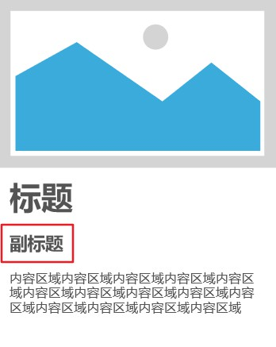

# 关于react组件
WHY - HOW - WHAT

### WHY

页面设计中，存在很多相似甚至相同的东西，如果复制粘贴，可以完成功能，但是存在以下缺点  

- 重复代码太多，后期维护改动比较繁琐，而且往往修改的是一样的内容

在React中推荐：对于相同相似功能的模块可以只写一个公用组件，在其他需要用到该组件的地方直接引用，后期改动的工作量会小很多

### HOW

如何在react中抽出复用组件？

#### 面临的问题1

1. 刚开始的时候，可能有这样一个非常简答的卡片组件，先假设为300px*400px的卡片，如下



对于这样的一个卡片，一般不要限制卡片的整体高度(限制后期改会麻烦)，只限制图片，标题，副标题，内容区域的几部分高度即可，其中文字部分要做溢出隐藏的处理。

可能有的页面设计，有副标题，有的没有，这时候抽出一个公用组件来适配两种不同布局，需要在引用组件的时候传递一个参数，比如`showSubTitle`，为布尔值，然后在Card组件利用三元表达式(a?b:c)或者&&来对副标题部分进行渲染或者不渲染

这时候可能某些页面可能需要260px*xxxpx的卡片，内容也是一样的,只是宽度变小了，如何改造呢？这里可能只需要改变card的宽度(前提是图片，标题等区域的宽度是100%而非固定的px，否则改起来又是一件麻烦事)，这里我们可能会想到，再传一个表示width的参数，比如`cardWidth`或者传一个style对象，比如`{{width: 260}}`

如下

```js
// 引用card
<Card showSubTitle={true} style={{width: 260}}>

// Card组件
const Card = ({showSubTitle, style}) => (
  <div style={style}>
    
    <div>标题</div>
    {
      showSubTitle && <div>副标题</div>
    }
    <div>内容</div>
  </div>
)
```

这时候可能有的内容区域可能只展示两行，然后，需要再给一个contentStyle这个props吗，我们发现这个时候Card组件接收的参数实在是有点多了，如果下次图片高度改了呢？难道再传一个picStyle这个参数吗？这个场景不是很常见，但是还是不要排除部分甲方/UI可能会要求这么做，笔者曾经经历过。。

这个时候你可能已经被传递这么多props搞得要蒙了，因为这不仅使组件复杂化了，还需要改进在Card组件使用的地方修改props(你可能会说没有特殊要求的直接使用defaultProps不就好了吗，这确实会有一些作用)，但是你一联想到，以后可能还会有更多的不同的样式，仅仅只是有细微的差别，传递这么多props不是要疯了吗。

现在该如何改造呢，你可能会想，之前可能应该把这个公用组件分开成几个单用的组件，这样就不会有改造的痛苦了(但这样不就又陷入到复制粘贴的僵局了么。。)

也许可以这样，传递一个参数，Card组件使用switch case语句来返回不同的JSX内容，比如

```js
// Card组件
const Card = ({name}) => {
  switch(name) {
    case 'home': 
      return (
        <div className={styles.homeCard}>
          
          <div>标题</div>
          <div>内容</div>
        </div>
      )
    case 'answer': 
      return (
        <div className={styles.answerCard}>
          
          <div>标题</div>
          <div>复标题</div>
          <div>内容</div>
        </div>
      )
  }
}
```

这样可能会比，复制粘贴好很多，因为以后改动的话只需要在同一处改动就好了，并且简化了props，只需要传递一个name就会返回不同形式的JSX内容

那有没有更好的办法呢？
