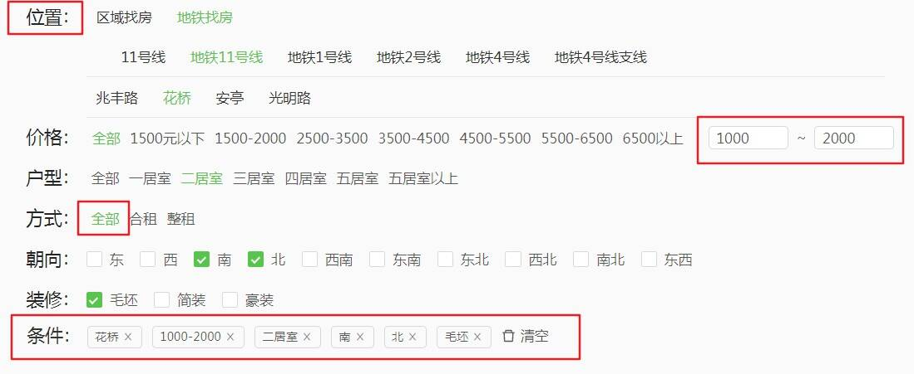

# 复杂业务组件

## 单选及复选表单封装

做房产React App的时候，对于一些选房的条件需要封装一个包含单选与复选的表单。如下图



分析一下，可以看出表单主要有两个用户操作，选择与取消选择

由于位置这个选项卡比较特殊，可以切换，并且可以选择二级。所以这个打算单独做一个组件

其余的我们可以看到，有单选，有多选，这些只需要写两个组件就可以了(一个负责渲染单选选项卡，一个负责多选选项卡)，后端提供字段是单选还是多选。

条件部分也需要单独，写一个组件，展示，并且可以对其进行删除操作。

这里使用了antd的基于rc-form的表单组件，使得封装简单了很多。

从后端拿到的表单选项信息的数据格式并不是我们想要的，首先将其转换成我们想要的数据，存在页面的redux里(笔者使用了dva)

```js
// 后端提供的数据
filterData: {
  positions: [{},{}] // 两个对象分别是区域找房和地铁找房，数据可以直接使用
  filters: [{
    Name: '租金',
    Field: 'Price',
    Type: 'CheckOne',
    Items: [
      { Text: '全部', Value: 0},
      { Text: '1500元以下', Value: 1}
      ...
    ]
  },
  {}, // 其他数据结构与上面类似，只不过Type是CheckOne还是CheckAll单选多选的区别
  {}...] 
}

// 处理filters中数据，用于已选择选项的匹配处理
// 比如
filterMap: {
  Price: [
    { Text: '全部', Value: 0},
    { Text: '1500元以下', Value: 1}
    ...
  ],
  HouseType: [
    {...}...
  ],
  ...
}

// params
// 用于存储参数对象，向后端发起请求，是用户已选择项的`唯一`数据源
{
  postions: [],
  Price: 0,
  HouseType: 2
  ...
}
```

理解了这些，那么这个组件的实现也就不会那么难了，

```js
// 这是需要的参数
<FormSelection
  positions={positions} // 位置
  filters={filters} // 其他单选，多选数据，包含checkone还是checkeall的信息
  filterMap={filterMap} // 其他单选多选数组
  params={params} // 表单数据 已选项 唯一数据源
  onFormChange={onFormChange} // 回调函数，当param发生变化时触发该回调。
/>
```

```js
// 位置需要单独写一个组件
// 价格需要在后面加上选择区间(这个暂且不说)
// 其他的选项根据CheckType渲染对应的单选还是多选
// 由于使用的是rc-form
renderRadio = (data) => {
  return (
    <Radio.Group>  // 单选Group组件，只能单选，由于rc-form接管了受控组件，会自动标记已选中状态，
      { data && data.length > 0 && data.map((v, i) =>
        <Radio.Button
          key={i} 
          value={v.Value}>{v.Text}</Radio.Button>) }  // 选中值与展示的文本
    </Radio.Group>
  );
};

renderCheck = (data) => {
  return (
    <Checkbox.Group> // 多选Group组件，已选中，由于rc-form接管了受控组件，会自动标记已选中状态
      { data && data.length > 0 && data.map((v, i) => 
        <Checkbox 
          key={i} 
          value={v.Value}>{v.Text}</Checkbox>) }
    </Checkbox.Group>
  );
};

// 渲染组件列表
{
  filters && filters.length > 0 && filters.map((v, i) => {
  return <Form.Item
    key={i}
    label={v.Name}
    {...formItemLayout}
  >
    {
      getFieldDecorator(v.Field)(
        v.Type === 'CheckOne' ? this.renderRadio(v.Items) : this.renderCheck(v.Items)
      )
    }
  </Form.Item>;
  })
}

// 当组件表单域 值发生变化时，执行回调onChange，发起api请求
Form.create({
  onValuesChange: (props, changedValues, allValues) => {
    // 位置选中 控件 值 length < 2 或者 ?? 
    if (changedValues.position && changedValues.position.length < 2 && Object.keys(changedValues).length === 1) {
      return;
    }
    props.onFormChange && props.onFormChange(allValues);
})(FormSelection)
```

选中，取消选中，以及选中状态高亮这部分已经完成了。下面要做的是：将已选中的条件 展示在表单下方，并且支持删除。触发表单变化，发起新的api请求

```js

```

## PC端特殊的options select

在地图找房中添加表单，用于用户输入条件


