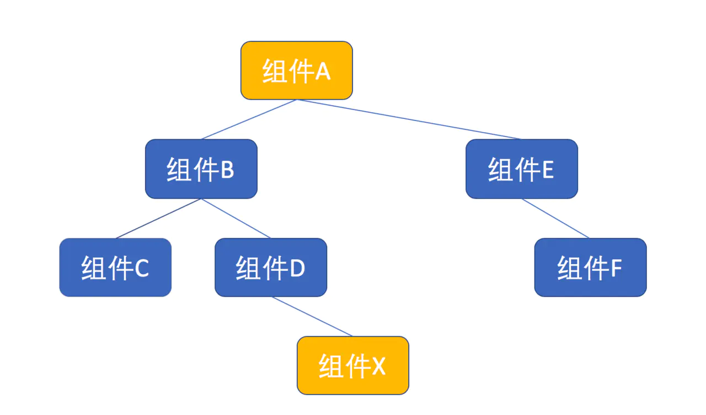

# 组件设计模式

在 React 中，组件无处不在，组件是 React 的一等公民

- 用户页面是组件
- 组件可以嵌套包装组成复杂功能
- 组件可以用来实现副作用

## 有状态组件和无状态组件

组件按照内部有无状态（数据）逻辑可分为有状态组件和无状态组件。

为什么要分割有状态组件和无状态组件？

软件设计中有一个原则，叫做“责任分离”（Separation of Responsibility），简单说就是让一个模块的责任尽量少，如果发现一个模块功能过多，就应该拆分为多个模块，让一个模块都专注于一个功能，这样更利于代码的维护。

使用 React 来做界面，就是获得驱动界面的数据，然后利用这些数据来渲染界面。当然，你可以在一个组件中就搞定，但是，最好把获取和管理数据这件事和界面渲染这件事分开。做法就是，把获取和管理数据的逻辑放在父组件，也就是有状态组件；把渲染界面的逻辑放在子组件，也就是无状态组件。

这么做的好处，是可以灵活地修改数据状态管理方式，比如，最初你可能用 Redux 来管理数据，然后你想要修改为用 Mobx，如果按照这种模式分割组件，那么，你需要改的只有有状态组件，无状态组件可以保持原状。

有状态组件和无状态组件这种模式的本质，就是把一个功能分配到两个组件中，形成父子关系，外层的父组件负责管理数据状态，内层的子组件只负责展示。

## 高阶组件

“高阶组件”名为“组件”，其实并不是一个组件，而是一个函数，只不过这个函数比较特殊，它接受至少一个 React 组件为参数，并且能够返回一个全新的 React 组件作为结果。

新产生的 React 组件是对作为参数的组件的包装，所以，有机会赋予新组件一些增强的“神力”。

使用高阶组件主要是为了抽取共同的数据逻辑，减少代码量。比如 `react-redux` 的 `connect` 就是用了高阶函数，这样，当每个组件想要引用 `redux` 里面的数据时，只需要使用 `connect` 函数就可以了。

比如，常见的 `connect` 使用方式

```js
import { connect } from "react-redux";

// const Counter = ...

const mapStateToProps = (state) => {
  return {
    counter: state.counter,
  };
};

export default connect(mapStateToProps)(Counter);
```

`connect` 实现的大致结构

```js
function connectAdvanced(selectorFactory) {
  // connect接收的第一个参数，selectorFactory 用于把redux数据传递给子组件的props
  return function wrapWithConnect(WrappedComponent) {
    // 参数是一个被包裹的组件
    // actualChildProps 返回的是 store 里面的数据(根据传入的selectorFactory) 以及 WrappedComponent 原有的 props
    const renderedWrappedComponent = useMemo(
      () => (
        <WrappedComponent {...actualChildProps} ref={reactReduxForwardedRef} />
      ),
      [reactReduxForwardedRef, WrappedComponent, actualChildProps]
    );
  };
}
```

因为引用 redux-store 数据的组件都会经过获取 redux-store 里面的数据并且订阅 redux-store 的变化，使用 connect 可以少写很多重复代码。

## render props 模式

所谓 render props，指的是让 React 组件的 props 支持函数这种模式。因为作为 props 传入的函数往往被用来渲染一部分界面，所以这种模式被称为 render props。

一个简单的 render props 组件如下

```js
const RenderAll = (props) => {
  return <React.Fragment>{props.children(props)}</React.Fragment>;
};
```

这个 RenderAll 预期子组件是一个函数，它所做的事情就是把子组件当做函数调用，调用参数就是传入的 props，然后把返回结果渲染出来，除此之外什么事情都没有做。

使用 RenderAll

```js
<RenderAll>{() => <h1>hello world</h1>}</RenderAll>
```

### 传递 props

## 提供者模式

存在这样的场景，如下



在上图中，组件 A 需要传递信息给组件 X，如果通过 props 的话，那么从顶部的组件 A 开始，要把 props 传递给组件 B，然后组件 B 传递给组件 D，最后组件 D 再传递给组件 X。

其实组件 B 和组件 D 完全用不上这些 props，但是又被迫传递这些 props，这明显不合理，要知道组件树的结构会变化的，将来如果组件 B 和组件 D 之间再插入一层新的组件，这个组件也需要传递这个 props，这就麻烦无比。

可见，对于跨级的信息传递，我们需要一个更好的方法。

在 React 中，解决这个问题应用的就是“提供者模式”。

### 使用

使用 `React.createContext` 函数创造一个“上下文”对象。

```js
import React, { useState } from "react";
import { Button } from "antd";

const ThemeContext = React.createContext({
  theme: "skyblue",
  toggleTheme: () => {},
});

const ThemeTogglerButton = () => {
  return (
    <ThemeContext.Consumer>
      {({ theme, toggleTheme }) => (
        <Button style={{ backgroundColor: theme }} onClick={toggleTheme}>
          Toggle Theme
        </Button>
      )}
    </ThemeContext.Consumer>
  );
};

const ButtonWrapper = () => (
  <div>
    <ThemeTogglerButton />
  </div>
);

const App = () => {
  const [theme, setTheme] = useState("skyblue");

  const toggleTheme = () => {
    setTheme((preState) => (preState === "skyblue" ? "green" : "skyblue"));
  };

  return (
    <ThemeContext.Provider value={{ theme, toggleTheme }}>
      <ButtonWrapper />
    </ThemeContext.Provider>
  );
};

export default App;
```

这个“上下文”对象 `ThemeContext` 有两个属性，分别是 `Provider` 和 `Consumer`

使用 `Provider` 来提供要传递的值，使用 `Consumer` 接收值

## 参考

- 程墨 React 设计模式和最佳实践
