# 找房筛选条件表单封装

最终实现的效果如下

点击选项，字体高亮并展示内容

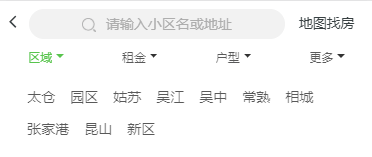

选中之后显示选择内容，高亮展示，隐藏表单内容，选择可以是单选也可以是多选。多选会有确定按钮进行控制

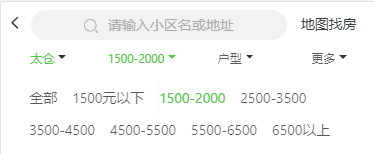

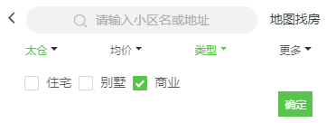

更多部分，有单选也有多选

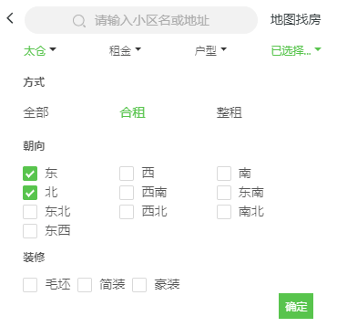

选中的条件，会在下面区域进行展示，条件可以删除

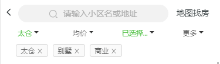

可以看到按照界面划分成 4 个区域

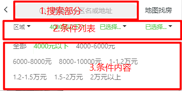
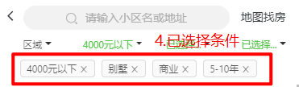

- 1.SearchText 区域
- 2.筛选条件
- 3.条件具体内容
- 4.条件的展示与删除

因为`新房，二手房，租房，社区`这些虽然条件不同，但是可以抽象成一个高阶组件，接收`house-type`来获取不同的筛选条件，生成对应的表单筛选区域。

定义该组件的接口，需要接收哪些`props`，

`筛选条件，当前选中条件`，以及`onChange`回调事件，项目中借用了`antd`的`Form`组件

```js
const OptionsWrapper = (houseType) => {
  const mapStateToProps = state => ({
    options: state[houseType].filterData,
    params: state[houseType].params, // 当前选中的条件
    filterMap: state[houseType].filterMap,
    shadow: state['global'].shadow // 当点击条件时，出现阴影
  })

  class Options extends Component {
    // 默认参数
    static defaultProps = {
      onChange: f => f
    }

    render() {
      return (
        <div>
          // search区域
          <SearchBar />
          // 条件列表区域
          <div className={styles.optionsWrapper}>
            // 条件第一个
            // 当前展示内容
            {
              true && ...
            }
            // 其他的三个条件等等...
          </div>
          // 当前条件区域
          {
            true && ...
          }
        </div>
      )
    }
  }
  return connect(mapStateToProps)(Form.create()(Options));
}

export default OptionsWrapper;
```

以租房为例，因为后端给的并不是我们想要的数据结构，最终我们处理好后的数据结构如下


解释一下几部分数据的作用

- filterData 包含筛选条件列表，其中 areas 是地区部分，filters 是剩余的条件，`Name`表示字段的名字，`Filed`表示传给后端的字段，`Type`表示是多选还是单选
- filterType 用于比对当前选中条件及展示
- params 是选中的条件，用于传给后端并且获取最新的数据

比如，当前选中的条件如下

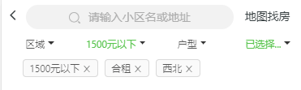
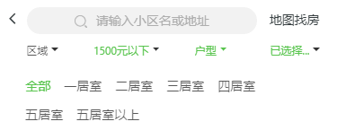


那么 params 的内容如下


紧接着设置当前需要的`state`

```js
class Options extends Component {
  constructor(props) {
    super(props)
    this.state = {
      selectTags: null,
      SearchText: '', // 当前关键字
      sectionStatus: [
        { name: '区域', show: false, highLight: false, isClick: false },
        { name: '', show: false, highLight: false, isClick: false },
        { name: '', show: false, highLight: false, isClick: false },
        { name: '更多', show: false, highLight: false, isClick: false },
      ],
    }
    this.debounceParamsChange = debounce(this.paramsChange, 100)
  }
  paramsChange = (keys) => {
    // 一个表单域或者多个
    const params = this.props.form.getFieldsValue(keys) // 传入一个数组，得到一个对象
    this.props.onChange({
      ...this.props.params,
      ...params,
    })
  }
}
```

因为每个`条件`都需要自己的`是否点击，文字是否高亮，当前文字`等状态信息，所以这里把筛选条件分成四个部分。因为区域和更多这部分文字是固定的，所以可以先给个默认值。在`constructor`中对`change`事件进行防抖处理。

先写地区选择部分，因为地区选择要传递的数据结构和其他的不太一样，所以需要单独处理一下

jsx 部分

```js
// import styles from './index.less'
// import classNames from 'classnames/bind'

<div className={styles.item}>
  <div
    className={classnames(styles.text, { [styles.clickActive]: sectionStatus[0].isClick })}
    onClick={() => {
      this.onShowSelect(0)
    }}
  >
    <span className={classnames(styles.textInfo, { [styles.active]: sectionStatus[0].highLight })}>{sectionStatus[0].name}</span>
    <span className={styles.arrow}></span>
  </div>
  {sectionStatus[0].show && (
    <div className={styles.options}>
      {getFieldDecorator('AreaID', { initialValue: params['AreaID'] })(
        <Radio.Group onChange={() => this.debounceParamsChange(['AreaID'])}>
          {areas.map((v) => (
            <Radio.Button key={v.ID} value={[v.ID]}>
              {v.Name}
            </Radio.Button>
          ))}
        </Radio.Group>
      )}
    </div>
  )}
</div>
```

`onClick`事件主要用于控制选项内容的显示以及样式的高亮，因为每个选项都要用到这个`click`事件，所以根据当前点击的下表来判断当前点击的是第几项

`onShowSelect`主要作用是点击之后显示当前的选项，并且高亮，以及隐藏其他所有出现的选项

因为使用的是`antd`的`Form`组件，所以需要给`Radio.Group`传递一个`onChange`事件

```js
// 点击出现表单,并且隐藏其他所有表单
onShowSelect = (index) => {
  const { dispatch } = this.props
  // 对state进行深拷贝
  let sectionStatusCopy = JSON.parse(JSON.stringify(this.state.sectionStatus))
  // 查一下当前是否有展示的，如果展示的key与点击的index相同，则直接隐藏
  let isSame = sectionStatusCopy.findIndex((item) => item.show === true) === index
  // 拷贝的对象将show和isClick全部初始化为false
  sectionStatusCopy = sectionStatusCopy.map((item) => ({ ...item, show: false, isClick: false }))
  // 如果下表相同，直接隐藏
  if (isSame) {
    this.setState({
      sectionStatus: sectionStatusCopy,
    })
    // 隐藏全局阴影
    dispatch({
      type: 'global/updateState',
      payload: {
        shadow: false,
      },
    })
    return
  }
  // 否则展示当前的选项
  sectionStatusCopy[index].show = true
  sectionStatusCopy[index].isClick = true
  this.setState({
    sectionStatus: sectionStatusCopy,
  })
  dispatch({
    type: 'global/updateState',
    payload: {
      shadow: true,
    },
  })
}
```

上面的全局状态`shadow`，是阴影，当显示条件时，就增加阴影不让用户点击下面的部分


紧接着处理中间两项，因为他们有可能是单选也有可能是多选，需要考虑这两种情况需要不同的组件

jsx 部分

```js
render() {
  const { areas, filters } = options; // 区域，others
  ...
  {
    filters &&
    filters.length > 0 &&
    filters.slice(0, 2).map((item, index) => {
      // 中间两项下标从1开始
      // isShown是当前是否展示选择区域
      const isShown = sectionStatus[index + 1].show;
      return (
        <Fragment key={item.Field}>
          {item.Type === 'CheckOne'
            ? this.renderOne(item, index, isShown)
            : this.renderSeveral(item, index, isShown)}
        </Fragment>
      );
    })
  }
}
```

下面书写`renderOne`以及`renderSeveral`逻辑，分别渲染单选和多选

```js
renderOne = (data, index, isShown) => {
  const { Field, Items, Name } = data
  const { sectionStatus } = this.state
  const { getFieldDecorator } = this.props.form
  const { params } = this.props
  return (
    <div className={styles.item}>
      <div
        className={classnames(styles.text, { [styles.clickActive]: sectionStatus[index + 1].isClick })}
        onClick={() => {
          this.onShowSelect(index + 1)
        }}
      >
        // 使用state中的name或者默认的Name字段
        <span className={classnames(styles.textInfo, { [styles.active]: sectionStatus[index + 1].highLight })}>{sectionStatus[index + 1].name || Name}</span>
        <span className={styles.arrow}></span>
      </div>
      {isShown && (
        <div className={styles.options}>
          {getFieldDecorator(Field, { initialValue: params[Field] })(
            <Radio.Group onChange={() => this.debounceParamsChange([data.Field])}>
              {Items.map((v) => (
                <Radio.Button key={v.Value} value={v.Value}>
                  {v.Text}
                </Radio.Button>
              ))}
            </Radio.Group>
          )}
        </div>
      )}
    </div>
  )
}
```

多选使用`确定`按钮触发 `onChange` 以及 `click` 事件

```js
renderSeveral = (data, index, isShown) => {
  const { Field, Name, Items } = data // 户型，价格等
  const { getFieldDecorator } = this.props.form
  const { sectionStatus } = this.state
  const { params } = this.props
  return (
    <div className={styles.item}>
      <div
        className={classnames(styles.text, { [styles.clickActive]: sectionStatus[index + 1].isClick })}
        onClick={() => {
          this.onShowSelect(index + 1)
        }}
      >
        <span className={classnames(styles.textInfo, { active: sectionStatus[index + 1].highLight })}>{sectionStatus[index + 1].name || Name}</span>
        <span className={styles.arrow}></span>
      </div>
      {isShown && (
        <div className={styles.options}>
          {getFieldDecorator(Field, { initialValue: params[Field] })(
            <Checkbox.Group>
              {Items.map((v) => (
                <div key={v.Value} className={styles.checkboxItem}>
                  <Checkbox value={v.Value}>{v.Text}</Checkbox>
                </div>
              ))}
            </Checkbox.Group>
          )}
          <div className={styles.confirm} onClick={() => this.paramsChange([data.Field])}>
            <div className={styles.confirmText}>确定</div>
          </div>
        </div>
      )}
    </div>
  )
}
```

紧接着处理更多部分，更多部分的内容渲染也要分单选和多选两种。

JSX 部分

```js
<div className={styles.item}>
  <div
    className={classnames(styles.text, { [styles.clickActive]: sectionStatus[3].isClick })}
    onClick={() => {
      this.onShowSelect(3)
    }}
  >
    <span className={classnames(styles.textInfo, { [styles.active]: sectionStatus[3].highLight })}>{sectionStatus[3].name || '更多'}</span>
    <span className={styles.arrow}></span>
  </div>
  {sectionStatus[3].show && (
    <div className={styles.options}>
      {filters &&
        filters.length > 0 &&
        filters.slice(2).map((v) => (
          <div className={styles.fieldItem} key={v.Field}>
            {v.Type === 'CheckOne' ? (
              <div className={styles.fieldItemRender}>{this.renderOneInMore(v)}</div>
            ) : (
              <div className={styles.fieldItemRender}>{this.renderSeveralInMore(v)}</div>
            )}
          </div>
        ))}
      <div
        onClick={() => {
          this.debounceParamsChange(filters.slice(2).map((item) => item.Field))
        }}
        className={styles.confirm}
      >
        <div className={styles.confirmText}>确定</div>
      </div>
    </div>
  )}
</div>
```

渲染更多里的单选和多选

```js
// 更多里的单选
renderOneInMore = (data) => {
  const { Field, Name, Items } = data
  const { getFieldDecorator } = this.props.form
  const { params } = this.props
  return (
    <div className={styles.moreOptions}>
      <div className={styles.name}>{Name}</div>
      <div className={styles.list}>
        {getFieldDecorator(Field, { initialValue: params[Field] })(
          <Radio.Group>
            <Row gutter={0}>
              {Items.map((v) => (
                <Col span={8} key={v.Value}>
                  {' '}
                  <Radio.Button value={v.Value}>{v.Text}</Radio.Button>{' '}
                </Col>
              ))}
            </Row>
          </Radio.Group>
        )}
      </div>
    </div>
  )
}

// 更多里的多选
renderSeveralInMore = (data) => {
  const { getFieldDecorator } = this.props.form
  const { Field, Name, Items } = data
  const { params } = this.props
  return (
    <div className={styles.moreOptions}>
      <div className={styles.name}>{Name}</div>
      <div className={styles.list}>
        {getFieldDecorator(Field, { initialValue: params[Field] })(
          <Checkbox.Group>
            <Row gutter={0}>
              {Items.map((v) => (
                <Col key={v.Value} span={8}>
                  <Checkbox value={v.Value}>{v.Text}</Checkbox>
                </Col>
              ))}
            </Row>
          </Checkbox.Group>
        )}
      </div>
    </div>
  )
}
```

至此，选择部分大部分完成了。下面开始完成已选择参数部分的处理。`Tags`

因为每次 `params` 变化的时候， 下面的已选参数都要发生变化，并且需要对列表的高亮以及文字变化做处理，这里我们需要在`componentDidUpdate`声明周期对 `params` 变化做处理

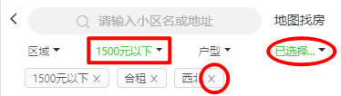

```js
componentDidUpdate(prevProps, prevState) {
  const { onChange, params, filterMap, onChangeHeight } = this.props;
  const { paramsSource } = this.props;

  if (prevProps.params !== params) {
    // 获取已选择条件的标签
    this.getTags();
    // 对高亮样式及文字做处理
    this.styleChange();
  }

  // 这里需要根据实际的高度来对formContainer做处理，这里先暂时忽略
  // const el = document.querySelector(`.${styles.formContainer}`);
  // if (el) {
  //   const elHeight = window.getComputedStyle(el);
  //   onChangeHeight(elHeight.height);
  // }
}
```

`getTags`以及 `styleChange` 逻辑

```js
// 对已选中条件进行数据处理
getTags = () => {
  const {
    params,
    options: { areas },
    filterMap,
  } = this.props
  const selectTags = []
  if (!Object.keys(params).length) return

  const selectArea = params.AreaID && params.AreaID.length && areas.find((v) => v.ID === params.AreaID[0])
  if (selectArea) {
    selectTags.push({
      field: 'AreaID',
      Text: selectArea.Name,
      Value: selectArea.ID,
    })
  }

  // 对params对象进行遍历
  Object.keys(params).forEach((field) => {
    // 除地区以外的筛选条件
    const current = filterMap[field]
    // 当前field对应的value
    const value = params[field]
    if (!current || !value) {
      return
    }

    if (value instanceof Array) {
      // 如果value是数组，那么筛选出符合Value进行map新数组
      const r = current.filter((v) => value.includes(v.Value)).map((item) => ({ ...item, field }))
      selectTags.push(...r)
    } else {
      // 否则直接向selectTags增加新一项
      const r = current.find((v) => v.Value === value)
      if (r) {
        selectTags.push({ ...r, field })
      }
    }
  })
  this.setState({ selectTags })
}
```

对样式处理还是有一点麻烦的，首先需要对 `params` 数据与当前 `state` 数据进行对比，然后对样式以及文字进行处理，对几种不同的情况(地区，中间两个，更多，单选多选)进行处理

```js
// 根据params做出样式上的变化
styleChange = () => {
  const { dispatch, filterMap, params, options } = this.props
  const { areas, filters } = options
  // if (!Object.keys(params).length) return
  // 参数变化的同时， 1.隐藏表单
  let sectionStatusCopy = JSON.parse(JSON.stringify(this.state.sectionStatus))
  sectionStatusCopy = sectionStatusCopy.map((item) => ({ ...item, show: false, isClick: false }))
  // 2. 改变文本及颜色
  let hasThing = false // 更多 初始 无参数
  Object.keys(params).forEach((field) => {
    const value = params[field] // 当前value
    const current = filterMap[field] // 当前filed所对应的所有可能值
    const currentFilter = filters.find((item) => item.Field === field)
    if (!current) return
    // if (!current || !value) {
    //   return
    // }
    // 下标
    const currentIndex = Object.keys(filterMap).findIndex((item) => item === field)
    if (currentIndex > 2) {
      // 更多
      if (hasThing !== true) {
        hasThing = Object.keys(filterMap).some((item) => {
          if (item === field) {
            if (value instanceof Array) {
              return value.length
            } else {
              return value
            }
          }
        })
      }

      if (hasThing) {
        sectionStatusCopy[3].name = '已选择...'
        sectionStatusCopy[3].highLight = true
      } else {
        sectionStatusCopy[3].name = ''
        sectionStatusCopy[3].highLight = false
      }
    } else {
      // 前三个
      const hasSomething = function() {
        if (value instanceof Array) {
          if (field === 'AreaID') {
            // 地区
            const [valueID] = value
            const currentSelect = areas.find((item) => item.ID === valueID) || {}
            return {
              name: value.length ? currentSelect.Name : '区域',
              has: value.length,
            }
          } else {
            return {
              name: value.length ? '已选择...' : currentFilter.Name,
              has: value.length,
            }
          }
        } else {
          let currentSelect
          if (value === 0) {
            currentSelect = {}
          } else {
            currentSelect = current.find((item) => item.Value === value) || {}
          }
          return {
            name: currentSelect.Text || currentSelect.Name,
            has: value,
          }
        }
      }
      if (hasSomething().has) {
        sectionStatusCopy[currentIndex].name = hasSomething().name
        sectionStatusCopy[currentIndex].highLight = true
      } else {
        sectionStatusCopy[currentIndex].name = hasSomething().name
        sectionStatusCopy[currentIndex].highLight = false
      }
    }
  })

  this.setState({
    sectionStatus: sectionStatusCopy,
  })
  // 3.去除shadow
  dispatch({
    type: 'global/updateState',
    payload: {
      shadow: false,
    },
  })
}
```

把 `selectTags` 渲染到页面

```js
const { selectTags } = this.state
{
  selectTags && selectTags.length > 0 && (
    <div className={styles.selectedParamsWrapper}>
      <div className={styles.params}>
        {selectTags.map((v) => (
          <Tag closable key={v.Text + v.Value} onClose={() => this.tagClose(v)}>
            {v.Text}
          </Tag>
        ))}
      </div>
    </div>
  )
}
```

`tagClose` 方法，用于删除当前选中的条件

```js
tagClose = (tag) => {
  const { params } = this.props
  const { field, Value } = tag
  const item = params[field]
  if (item instanceof Array) {
    const res = item.filter((v) => v !== Value)
    this.props.onChange({ ...params, [field]: res })
  } else {
    this.props.onChange({ ...params, [field]: '' })
  }
}
```

至此，条件筛选表单这个组件基本完成了。还有`InputSearch`这个组需要完成。

`InputSearch` 组件需要实现的功能，接收`value`和`onchange`回调。当input聚集焦点的时候，palceholder移动到左边，并且右边出现`叉号`，点击叉号可以使`input`的失去焦点且重置当前参数

封装也是参照了`antd-mobile`

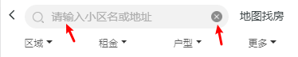

```js
const prefixCls = 'inputSearch';

const InputSearch = props => {
  const { style, disabled, placeholder, maxLength } = props;
  const [value, setValue] = useState(''); // input值
  const [focus, setFocus] = useState(false); // 当前是否是聚焦状态
  const inputRef = useRef(null); // input实例
  const inputContainerRef = useRef(null); // input Container实例
  const syntheticPhRef = useRef(null); // 合成

  // 表单提交事件
  const onSubmit = e => {
    e.preventDefault();
    props.onSubmit(value || '');
  };

  // input change事件
  const onChange = e => {
    if (!focus) {
      setFocus(true);
    }
    const value = e.target.value;
    setValue(value);
    if (props.onChange) {
      props.onChange(value);
    }
  };

  // 聚集焦点
  const onFocus = () => {
    setFocus(true);
    if (inputRef) {
      inputRef.current.focus();
    }
    if (props.onFocus) {
      props.onFocus();
    }
  };

  // 失去焦点
  const onBlur = () => {
    setFocus(false);
    if (props.onBlur) {
      // fix autoFocus item blur with flash
      setTimeout(() => {
        // fix ios12 wechat browser click failure after input
        if (document.body) {
          document.body.scrollTop = document.body.scrollTop;
        }
      }, 100);
      props.onBlur();
    }
  };

  // 清除
  const onClear = () => {
    doClear();
  };

  // 清除
  const doClear = () => {
    setFocus(false);
    setValue('');
    if (props.onClear) {
      props.onClear('');
    }
    if (props.onChange) {
      props.onChange('');
    }
  };

  // 盒子样式
  const wrapCls = useMemo(() => {
    return classnames(styles[prefixCls], {
      [styles[`${prefixCls}-start`]]: !!(focus || (value && value.length > 0)),
    });
  }, [focus, value]);

  const clearCls = useMemo(() => {
    return classnames(styles[`${prefixCls}-clear`], {
      [styles[`${prefixCls}-clear-show`]]: !!(focus || (value && value.length > 0)),
    });
  }, [focus, value]);

  return (
    <form onSubmit={onSubmit} className={wrapCls} style={style} ref={inputContainerRef} action="#">
      <div className={styles[`${prefixCls}-input`]}>
        <div className={styles[`${prefixCls}-synthetic-ph`]} ref={syntheticPhRef}>
          <span className={styles[`${prefixCls}-synthetic-ph-container`]}>
            <i className={styles[`${prefixCls}-synthetic-ph-icon`]} />
            <span
              className={styles[`${prefixCls}-synthetic-ph-placeholder`]}
              // tslint:disable-next-line:jsx-no-multiline-js
              style={{
                visibility: placeholder && !value ? 'visible' : 'hidden',
              }}
            >
              {placeholder}
            </span>
          </span>
        </div>
        <input
          type="search"
          className={styles[`${prefixCls}-value`]}
          value={value}
          disabled={disabled}
          placeholder={placeholder}
          onChange={onChange}
          onFocus={onFocus}
          onBlur={onBlur}
          ref={inputRef}
          maxLength={maxLength}
        />
        <a onClick={onClear} className={clearCls} />
      </div>
    </form>
  );
};

function noop() {}
InputSearch.defaultProps = {
  prefixCls: 'inputSearch', // 前缀样式名
  placeholder: '请输入...', // 占位文字
  onSubmit: noop, // 表单提交回调
  onChange: noop, // input change事件回调
  onFocus: noop, // 聚焦事件
  onBlur: noop, // 失去焦点事件
  value: '',
  autoFocus: false,
  onClear: noop,
  maxLength: 20,
};

export default InputSearch;
```

<!-- # 复杂业务组件

## 单选及复选表单封装

做房产React App的时候，对于一些选房的条件需要封装一个包含单选与复选的表单。如下图


分析一下，可以看出表单主要有两个用户操作，选择与取消选择

## 位置

由于位置这个选项卡比较特殊，可以切换，并且可以选择二级。所以这个打算单独做一个组件

## 价格，户型，方式，朝向，装修

其余的我们可以看到，有单选，有多选，这些只需要写两个组件就可以了(一个负责渲染单选选项卡，一个负责多选选项卡)，后端提供字段是单选还是多选。

## 条件

条件部分也需要单独，写一个组件，展示，并且可以对其进行删除操作。

## 数据处理

这里使用了antd的基于rc-form的表单组件，使得封装简单了很多。

从后端拿到的表单选项信息的数据格式并不是我们想要的，首先将其转换成我们想要的数据，存在页面的redux里(笔者使用了dva)

```js
// 后端提供的数据
filterData: {
  positions: [{},{}] // 两个对象分别是区域找房和地铁找房，数据可以直接使用
  filters: [
  {
    Name: '租金',
    Field: 'Price',
    Type: 'CheckOne',
    Items: [
      { Text: '全部', Value: 0},
      { Text: '1500元以下', Value: 1}
      ...
    ]
  },
  {}, // 其他数据结构与上面类似，只不过Type是CheckOne还是CheckAll单选多选的区别
  {}...]
}

// 处理filters中数据，用于已选择选项的匹配处理
// 比如
filterMap: {
  Price: [
    { Text: '全部', Value: 0},
    { Text: '1500元以下', Value: 1}
    ...
  ],
  HouseType: [
    {...}...
  ],
  ...
}

// params
// 用于存储参数对象，向后端发起请求，是用户已选择项的`唯一`数据源
{
  postions: [],
  Price: 0,
  HouseType: 2
  ...
}
```

我们需要把这些处理好的数据传递给 选择区 这个容器组件

```js
// 这是需要的参数
<FormSelection
  positions={positions} // 位置
  filters={filters} // 其他单选，多选数据，包含checkone还是checkeall的信息
  filterMap={filterMap} // 其他单选多选数组
  params={params} // 表单数据 已选项 唯一数据源
  onFormChange={onFormChange} // 回调函数，当param发生变化时触发该回调。
/>
```

```js
// 位置需要单独写一个组件
// 价格需要在后面加上选择区间(这个暂且不说)
// 其他的选项根据CheckType渲染对应的单选还是多选
// 由于使用的是rc-form
renderRadio = (data) => {
  return (
    <Radio.Group>  // 单选Group组件，只能单选，由于rc-form接管了受控组件，会自动标记已选中状态，
      { data && data.length > 0 && data.map((v, i) =>
        <Radio.Button
          key={i}
          value={v.Value}>{v.Text}</Radio.Button>) }  // 选中值与展示的文本
    </Radio.Group>
  );
};

renderCheck = (data) => {
  return (
    <Checkbox.Group> // 多选Group组件，已选中，由于rc-form接管了受控组件，会自动标记已选中状态
      { data && data.length > 0 && data.map((v, i) =>
        <Checkbox
          key={i}
          value={v.Value}>{v.Text}</Checkbox>) }
    </Checkbox.Group>
  );
};

// 渲染组件列表
{
  filters && filters.length > 0 && filters.map((v, i) => {
  return <Form.Item
    key={i}
    label={v.Name}
    {...formItemLayout}
  >
    {
      getFieldDecorator(v.Field)(
        v.Type === 'CheckOne' ? this.renderRadio(v.Items) : this.renderCheck(v.Items)
      )
    }
  </Form.Item>;
  })
}

// 当组件表单域 值发生变化时，执行回调onChange，发起api请求
Form.create({
  onValuesChange: (props, changedValues, allValues) => {
    // 位置选中 控件 值 length < 2 或者 ??
    if (changedValues.position && changedValues.position.length < 2 && Object.keys(changedValues).length === 1) {
      return;
    }
    props.onFormChange && props.onFormChange(allValues);
})(FormSelection)
```


选中，取消选中，以及选中状态高亮这部分已经完成了。下面要做的是：将已选中的条件 展示在表单下方，并且支持删除。触发表单变化，发起新的api请求

```js
// 待补充...
```

## PC端特殊的options select

在地图找房中添加表单，用于用户输入条件

 -->
