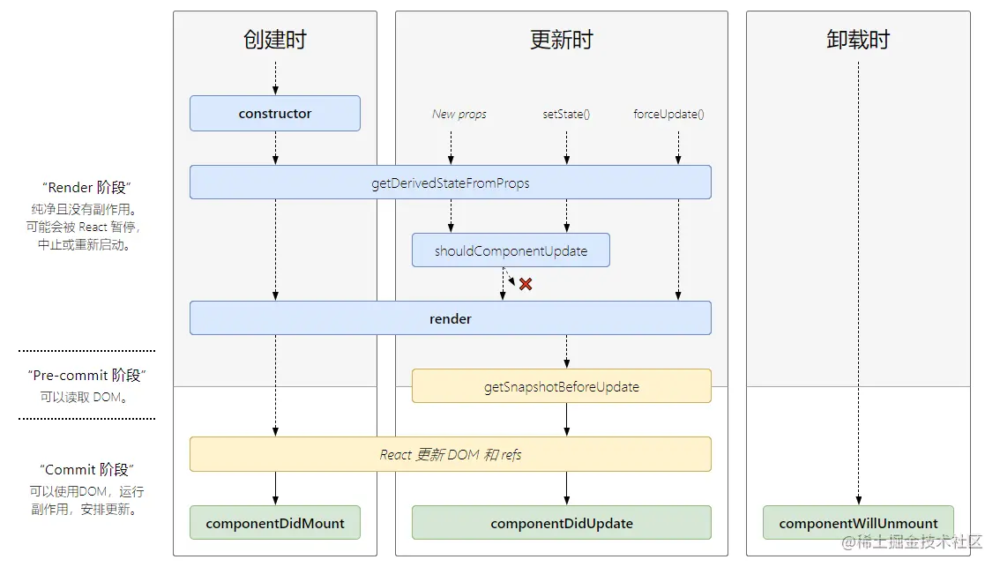
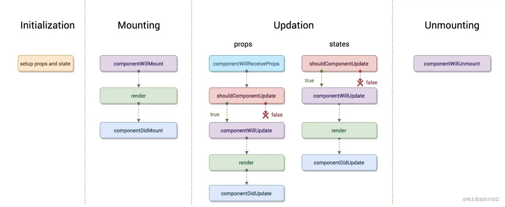

# React 生命周期总结&应用

[react 文档](https://zh-hans.reactjs.org/docs/react-component.html)里面已经说的很清楚了，这里在总结一下

## React新的生命周期



### 组件生命周期的三个阶段：

Mounting（加载阶段）

Updating（更新阶段）

Unmounting（卸载阶段）

#### 挂载

当组件实例被创建并插入 DOM 中时，其生命周期调用顺序如下：

constructor()

static getDerivedStateFromProps()

render()

componentDidMount()

UNSAFE_componentWillMount()

#### 更新

当组件的 props 或 state 发生变化时会触发更新。组件更新的生命周期调用顺序如下：

static getDerivedStateFromProps()

shouldComponentUpdate()

render()

getSnapshotBeforeUpdate()

componentDidUpdate()

UNSAFE_componentWillUpdate()

UNSAFE_componentWillReceiveProps()


#### 卸载

当组件从 DOM 中移除时会调用如下方法：

componentWillUnmount


## React16.3 之前的生命周期

旧的生命周期



UNSAFE_componentWillMount()

UNSAFE_componentWillUpdate()

UNSAFE_componentWillReceiveProps() 三个生命周期即将废弃

## 关于生命周期，下面这两篇文章写的比较详细

[你真的了解 React 生命周期吗](https://juejin.cn/post/6844904021233238024)

[深入详解React生命周期](https://juejin.cn/post/6914112105964634119)

## 实践中踩坑点

React 组件是一个 class 类(也可以理解为函数)

### `constructor()`

class 在被调用执行的时候，首先会调用 constructor()方法，该方法在 class 中的作用是

1. 继承
2. 赋予 class 实例属性
3. 初始化 this

通常在 react 中，会这样使用

```js
// Child类继承自React.Component类
class Child extends React.Component {
  constructor(props) {
    super(props)
    this.state = {
      name: 'xbl',
    }
  }
}
```

如果 props 是确定的值，而不是动态获取的，那么 Child 的 props 在 constructor 里面就可以拿到(也可以使用 defaultProps 设置默认的 props)


### `componentDidMount()`

组件挂载后（插入 DOM 树中）立即调用。依赖于 DOM 节点的初始化应该放在这里。如需通过**网络请求获取数据**，此处是实例化请求的好地方。

也可以在此处**添加订阅**，并在`componentWillUnmount()`取消订阅

### `shouldComponentUpdate(nextProps, nextState)`

组件接收到新的 props 或者 state 时调用，return true 就会更新 dom（使用 diff 算法更新），return false 能阻止更新（不调用 render）

**此生命周期是减少组件渲染的重要手段**

### `componentDidUpdate(prevProps, prevState, snapshot)`

组件更新完毕后，触发该生命周期，因为已经更新完毕，所以有`prevProps`获取之前的状态

如果在该生命周期中无条件的使用了 setState，会造成***死循环***,所以应该使用条件语句(因为this.setState必然会触发重新render,render之后必然触发componentDidUpdate，所以会造成死循环)

当组件更新后，可以在此处对 DOM 进行操作。如果你对更新前后的 props 进行了比较，也可以选择在此处进行网络请求。

```js
componentDidUpdate(prevProps) {
  // 典型用法（不要忘记比较 props）：
  if (this.props.userID !== prevProps.userID) {
    this.fetchData(this.props.userID);
  }
}
```

如果`render()`之后没有触发`componentDidUpdate()`，请检查该组件声明的位置

### 新的静态方法的生命周期

静态方法`static getDerivedStateFromProps(props, state)`

`getSnapshotBeforeUpdate()`

静态方法获取不到`this`

`getSnapshotBeforeUpdate`需要结合`componentDidUpdate`  // TODO 使用场景？

### 使用生命周期的注意事项

React 构建的 App 是单页面应用，所以一旦刷新浏览器，React 该页面内的所有组件会重新执行 componentDidMount()，也就是说，该页面所需要的数据，必须重新拉取一下才能重新获得。

所以为了能够获得之前的状态，我们可能需要把一些参数存放在**路由参数里**，比如`/news?type=1`，当然当参数比较多时，可以考虑放在`sessionStorage`里面

### 状态保持

如果两个同级页面 a,b，用户需要先进入 a，才能进入 b。

假设我们在 a 中请求 api 获取了数据存在 redux 里面，然后在 b 页面就可以直接从 redux 中拿到数据。但是，如果我们在 b 页面刷新浏览器。就会拿不到想要的数据，因为请求 api 是在 a 页面发起的。

解决方案 1. 在 a,b 的容器父组件获取数据 2. 在 a,b 页面都进行 api 的请求。

所以，在构建一个页面组件时，我们需要考虑，用户可以通过哪些手段来进入这个页面，

比如是浏览器刷新？比如从路由连接直接进入？又或者从同级动态路由进入？(这个不会触发 componentDidMount，会触发 props change)。如何维持或者更新状态/数据是一个值得思考的问题

同级路由，一般发生在动态路由上，比如，`/:id`, 商品的动态路由，文章的动态路由等等

## 参考


- [你真的了解 React 生命周期吗](https://juejin.cn/post/6844904021233238024)
- [深入详解React生命周期](https://juejin.cn/post/6914112105964634119)
- [React.CompAonent](https://zh-hans.reactjs.org/docs/react-component.html)
- [React-新的生命周期（React16 版本）](https://segmentfault.com/a/1190000016617400)
- [React 新生命周期--getDerivedStateFromProps](https://www.jianshu.com/p/50fe3fb9f7c3)
