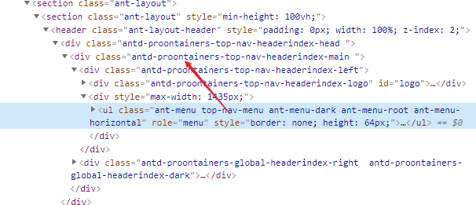
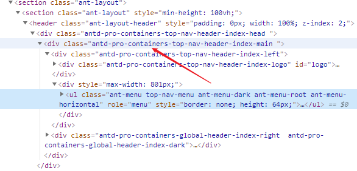
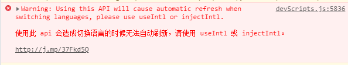
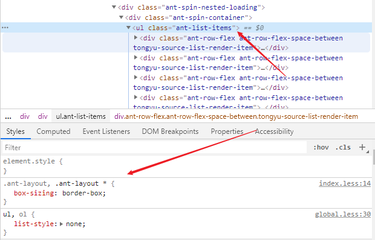

# umi3 升级

## 修改相关配置

### package.json

```js

"devDependencies": {

-  "umi": "2.13.0"

+  "umi": "^3.2.19"

-  "umi-plugin-react": "1.15.6"

+  "@umijs/preset-react": "^1.6.4"

}

"dependencies": {

-  "dva": "^2.4.0"

}

```

### tsconfig.json

增加@@别名，支持更好的 ts 提示

```js

"compilerOptions": {

 "paths": {

    "@/*": ["./src/*"],

 + "@@/*": ["./src/.umi/*"]

 }

}

```

### config/config.local.js

```js

{

 - history: 'hash'

 + history: {

 +  type: 'hash',

 + }

}

```

### config/config.prod.js

```js

{

 - history: 'browser'

 + history: {

 +  type: 'browser',

 + }

}

```

### config/config.js

#### plugin 配置拍平

```js
export default {
  plugins: [
    [
      "umi-plugin-react",
      {
        antd: true,
        dva: {
          hmr: true,
        },
        targets: {
          ie: 11,
        },
        locale: {
          antd: true,
          enable: true, // default false
          default: "zh-CN", // default zh-CN
          // default true, when it is true, will use `navigator.language` overwrite default
          baseNavigator: false,
        },
        dynamicImport: {
          loadingComponent: "/containers/ProgressLine",
        },
      },
    ],
  ],
};
```

改成如下格式

```js
export default {
  antd: {},
  dva: {
    hmr: true,
  },
  locale: {
    // antd: true,
    default: "zh-CN", // default zh-CN
    // default true, when it is true, will use `navigator.language` overwrite default
    baseNavigator: false,
  },
  dynamicImport: {
    loading: "@/containers/ProgressLine",
  },
};
```

- 修改 antd，locale 配置
- dva 配置不变
- 删除 targets，与原本 umi 配置 targets 重合了
- dynamicImport 内置为 umi 配置，并且需要修改引用路径

#### 其余配置

- 删除 disableRedirectHoist
- 删除 manifest，原来的配置与 umi2/3 不吻合
- 删除 layout 配置，在 umi2 并未找到此配置（在 umi3 如果使用此配置，需要额外安装 `@ant-design/pro-layout` 配合 `@umijs/plugin-layout` 插件使用，可能会出问题）
- lessLoaderOptions 命名为 lessLoader
- cssLoaderOptions 命名为 cssLoader，并修改 getLocalIdent 选项，不修改会产生样式名解析错误，导致样式错乱





完整配置

```js
// https://umijs.org/config/
import { utils } from "umi";
import pageRoutes from "./router.config";
import webpackPlugin from "./plugin.config";
import setting from "../src/defaultSettings";

const { winPath } = utils;

export default {
  antd: {},
  dva: {
    hmr: true,
  },
  locale: {
    // antd: true,
    default: "zh-CN", // default zh-CN
    // default true, when it is true, will use `navigator.language` overwrite default
    baseNavigator: false,
  },
  dynamicImport: {
    loading: "@/containers/ProgressLine",
  },
  targets: {
    ie: 11,
  },
  // 路由配置
  routes: pageRoutes,
  // Theme for antd
  // https://ant.design/docs/react/customize-theme-cn
  theme: setting.themeVars,
  externals: {
    "@antv/data-set": "DataSet",
    moment: "moment",
    jquery: "$",
    mockjs: "Mock",
    "uuid/v4": "uuidv4",
  },
  ignoreMomentLocale: true,
  lessLoader: {
    javascriptEnabled: true,
  },
  cssLoader: {
    modules: {
      getLocalIdent: (context, localIdentName, localName) => {
        if (
          context.resourcePath.includes("node_modules") ||
          context.resourcePath.includes("ant.design.pro.less") ||
          context.resourcePath.includes("global.less")
        ) {
          return localName;
        }
        const match = context.resourcePath.match(/src(.*)/);
        if (match && match[1]) {
          const antdProPath = match[1].replace(".less", "");
          const arr = winPath(antdProPath)
            .split("/")
            .map((a) => a.replace(/([A-Z])/g, "-$1"))
            .map((a) => a.toLowerCase());
          return `antd-pro${arr.join("-")}-${localName}`.replace(/--/g, "-");
        }
        return localName;
      },
    },
  },
  chainWebpack: webpackPlugin,
};
```

## 代码层

### import all from umi

不再保留 umi/xxx 的接口，全部从 umi 中 import。

```js

- import Link from 'umi/link';

+ import { Link } from 'umi';

- import withRouter from 'umi/withRouter';

+ import { withRouter } from 'umi';

- import { formatMessage } from 'umi/locale';

+ import { formatMessage } from 'umi';

```

### umi/router

改用 history 代替。

```js

- import router from 'umi/router';

+ import { history } from 'umi';

- router.push('/foo');

+ history.push('/foo');

```

### formatMessage

继续使用 formatMessage 控制台会报警告，在切换语言的时候无法自动刷新

项目暂时没有用到该特性 `SelectLang/index.js`



```js
import React, { useState } from "react";
import { useIntl } from "umi";

export default function () {
  const intl = useIntl();
  return (
    <button type="primary">
      {intl.formatMessage(
        {
          id: "name",
          defaultMessage: "你好，旅行者",
        },
        {
          name: "旅行者",
        }
      )}
    </button>
  );
}
```

```js
import React from "react";
import { injectIntl, FormattedRelative } from "react-intl";

const to2Digits = (num) => `${num < 10 ? `0${num}` : num}`;

const RelativeTime = ({ date, intl }) => {
  date = new Date(date);

  let year = date.getFullYear();
  let month = date.getMonth() + 1;
  let day = date.getDate();

  let formattedDate = intl.formatDate(date, {
    year: "long",
    month: "numeric",
    day: "numeric",
  });

  return (
    <time
      dateTime={`${year}-${to2Digits(month)}-${to2Digits(day)}`}
      title={formattedDate}
    >
      <FormattedRelative value={date} />
    </time>
  );
};

export default injectIntl(RelativeTime);
```

### 删除 src/.umi 执行 yarn start

另外，umi3 项目启动后不会自动打开浏览器

## 问题

ant 组件部分样式没有加载成功（这个问题有的电脑出现，有的没出现？）



如果出现了，下面的解决方法可以参考：

```js
- @import '~antd/lib/style/themes/default.less';
+ @import '~antd/dist/antd.less';
```

比如：添加之前在运行文件 `umi.js` 中未发现 `ant-list-items`，修改后可以找到，且包大小未发生变化。

## 参考

- [升级到 umi3](https://umijs.org/zh-CN/docs/upgrade-to-umi-3)
- [升级 antd pro 项目到 umi@3](https://umijs.org/zh-CN/guide/upgrade-antd-pro-to-umi-3)
- [useIntl](https://github.com/umijs/plugins/tree/d0d70cc811df398ec8794476b33a4b6a0913c064/packages/plugin-locale#useintl)
- [Update to injectIntl()](https://formatjs.io/docs/react-intl/upgrade-guide-2x/#update-to-injectintl)
