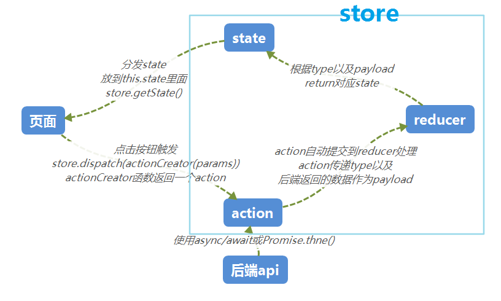

# vue-element-admin 的使用

4.2.1 版本

## 项目的目录

```js
├── src/
|   ├── api         // 用户请求的api都放在这个目录下
|   ├── assets      // 项目中使用的图片等静态资源
|   ├── components
|   ├── directive
|   ├── filters
|   ├── icons       // svg图标
|   ├── components
|   ├── layout
|   ├── router      // 路由
|   ├── store       // vuex
|   ├── styles
|   ├── utils
|   ├── views       // 页面文件
|   ├── App.vue     // 入口页面
|   ├── main.js     // 入口初始化
|   ├── permission.js  // 权限管理
|   └── settings.js
├── build/
├── mock/
├── public/         // html模板
├── tests/
├── .env.development
├── .env.production
└── vue.config.js
```

## 初始化

因为后台接口已经写好了，所以需要取消 mock，并更改 api 地址。这里使用的是`vue-admin-template`，在其基础上进行更改

`vue.config.js`注释 webpack 的 devServer 配置项的`before`项

`.env.development`修改 api 请求地址

发现启动项目的时候会打开两次浏览器，将 webpack 配置项 devServer 的`open:true`改为`false`，并在`package.json`文件的 dev 命令后面加上`--open`。

约定：views-api-router 路由-文件-api 一一对应
vuex：只用来存储全局的信息，比如 token，用户信息等
eslint: vscode 插件开启保存时自动修复，不过代码格式化的问题还是需要 prettier 帮忙。同时安装 vetur

## 登录及权限管理

登录从后端拿到 token 后，存放在 cookie 中，当然也可以放在 localstorage 中。然后在 axios 拦截器中配置请求头。

登录的地方用到的是 vuex，这里把使用 vuex 的过程记录一下，对比 redux




可以看出，vuex 与 redux 相似度很高。除了一些 api 的不同，还有两点要注意：

1. redux 中 action 会自动提交给 reducer 进行处理，而在 vuex 中 action 需要手动进行 commit 到 mutations

2. redux reducer 处理 action 时，不直接改变 state，而是返回一个新的 state。而 vuex 的 mutations 是直接对 state 数据进行修改

## 表单与表格查询

做后台系统最主要的部分就是数据的提交与展示，表单与表格是必不可少的部分。

一个复杂的表格页面应该有参数查询，表格导出等功能。

而一个表单应该有**新建、查看、编辑**的功能。这三种功能应该是同一个页面，根据不同的 prop 展示不同状态。

根据需要封装上传文件组件为表单，比如

```js
<el-form :model="temp">
  <el-form-item prop="TrademarkPicID" label="商标上传">
    <upload v-model="temp.TrademarkPicID" :disabled="isDisabled" />
  </el-form-item>
</el-form>
```

`upload`即我们要封装的组件，因为`upload`组件作为表单数据，进行了双向绑定，所以会自动获得一个名为`value`的 prop 以及一个名为`input`的自定义事件。我们可以直接在`el-upload`的基础上进行改造

```js
<template>
  <div>
    <el-upload
      :action="uploadUrl"
      :limit="limit"
      :list-type="listType"
      :on-preview="handlePictureCardPreview"
      :on-remove="handleRemove"
      :on-success="handleSuccess"
      :on-change="handleChange"
      :class="{hide:hideUpload}"
      :file-list="fileList"
    >
      <i class="el-icon-plus" />
    </el-upload>
    <el-dialog :visible.sync="dialogVisible" append-to-body>
      
    </el-dialog>
  </div>
</template>

<script>
import { mapState } from 'vuex'
export default {
  name: 'Upload',
  // model: {
  //   prop: 'value',
  //   event: 'input'
  // },
  props: {
    // 使用v-model的时候，会给内部组件设置一个value值
    value: { type: Object, default: null },
    limit: { type: Number, default: 1 },
    listType: { type: String, default: 'picture-card' },
    multiple: { type: Boolean, default: false },
    disabled: { type: Boolean, default: false }
  },
  data() {
    return {
      dialogImageUrl: '', // 图片url路径
      dialogVisible: false, // 预览dialog
      hideUpload: false // 是否隐藏上传按钮
    }
  },
  computed: {
    ...mapState({
      uploadUrl: state => state.settings.uploadUrl
      // baseUrl: state => state.settings.baseUrl
    }),
    // 根据prop或者用户手动上传的图片进行改变
    fileList() {
      return this.value ? this.value.fileList : []
    }
  },
  watch: {
    // hideUpload需要根据value进行变化
    value: function(current, old) {
      if (current === null) {
        this.hideUpload = false
        return false
      }
      this.hideUpload = current.fileList.length >= this.limit
    }
  },
  methods: {
    handleChange(file, fileList) {
      if (!(file && file.response > 0)) {
        // input事件
        this.hideUpload = fileList && fileList.length >= this.limit
        // this.$emit('input', null)
      } else {
        console.log(file, fileList)
        // input事件
        this.$emit('input', {
          id: file.response.Data.ID,
          fileList: file.response.Data.AttachmentList.map(v => ({
            uid: v.ID,
            name: v.FileName,
            createDate: v.CreateDate,
            status: 'done',
            url: v.FilePath
          }))
        })
        this.hideUpload = fileList.length >= this.limit
      }
    },
    // 上传成功
    handleSuccess(response, file, fileList) {
      console.log('上传成功')
    },
    // 删除
    handleRemove(file, fileList) {
      console.log(file, fileList)
      this.hideUpload = fileList.length >= this.limitCount
    },
    // 预览
    handlePictureCardPreview(file) {
      console.log(file)
      this.dialogImageUrl = file.url
      this.dialogVisible = true
    }
  }
}
</script>

<style>
.hide .el-upload--picture-card {
  display: none;
}
</style>
```

文件下载主要参考了[JavaScript 接收 excel 文件流并下载](https://www.jianshu.com/p/de2be37db7a7)

## 参考

- [手摸手，带你用 vue 撸后台 系列](https://juejin.im/post/59097cd7a22b9d0065fb61d2)
